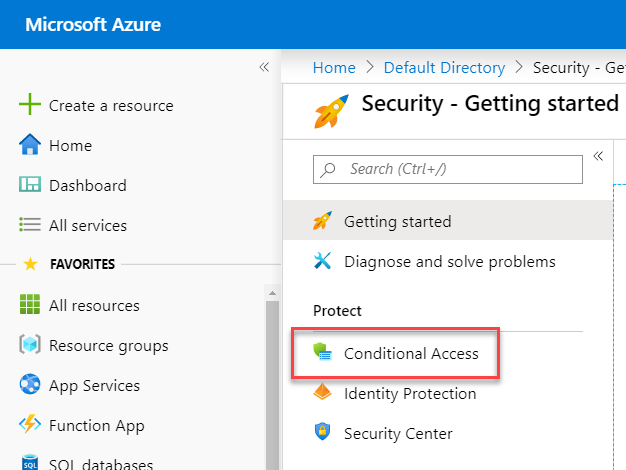
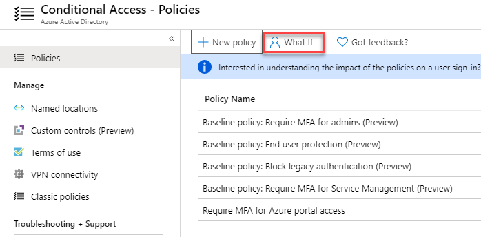
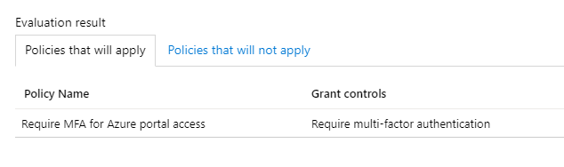
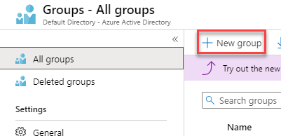
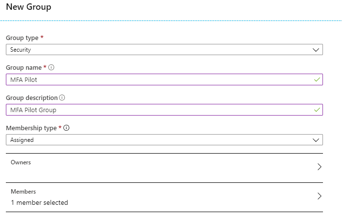

# Module 1: Lab 3: Using Multi-Factor Authentication for Secure Access

## Exercise 1: MFA Authentication Pilot (Require MFA for specific apps with Azure Active Directory conditional access)

### Task 1: Create your conditional access policy 

This section shows how to create the required conditional access policy. The scenario uses:

- The Azure portal as placeholder for a cloud app that requires MFA. 
- Your sample user to test the conditional access policy.  

In your policy, set:

|Setting |Value|
|---     | --- |
|Users and groups | Isabella Simonsen |
|Cloud apps | Microsoft Azure Management |
|Grant access | Require multi-factor authentication |

 
1.  Sign in to the Azure Portal.

2.  In the Azure portal, on the hub menu, click **Azure Active Directory**.

3.  In the **Manage** section, click **Properties**, and click **Manage Security defaults**.

4.  Change the **Enable Security defaults** option to **No**. Under reason, select **My organisation is using Conditional Access**, and click **Save**. 

5.  In the **Manage** section, click **Security**.

6.  In the **Security** blade, click **Conditional access**.

     
 
7.  On the **Conditional Access** page, in the toolbar on the top, click **New Policy**.

    **Note**: if this is greyed out, refresh the browser session.

8.  On the **New** page, in the **Name** textbox, type **Require MFA for Azure portal access**.

9.  In the **Assignment** section, click **Users and groups**.

10.  On the **Users and groups** page, perform the following steps:

      a. Click **Select users and groups**, and then select **Users and groups**.

      b. Click **Select**.

      c. On the **Select** page, select **Isabella Simonsen**, and then click **Select**.

      d. On the **Users and groups** page, click **Done**.

11.  Click **Cloud apps or actions**.

12. On the **Cloud apps** page, perform the following steps:

    a. Click **Select apps**.

    b. Click **Select**.

    c. On the **Select** page, select **Microsoft Azure Management**, and then click **Select**.

    d. On the **Cloud apps** page, click **Done**.

13.  In the **Access controls** section, click **Grant**.

14.  On the **Grant** page, perform the following steps:
     1. Select **Grant access**.
     2.  Select **Require multi-factor authentication**.
     3.  Click **Select**.

15.  In the **Enable policy** section, click **On**.

16.  Click **Create**.

### Task 2: Evaluate a simulated sign-in

Now that you have configured your conditional access policy, you probably want to know whether it works as expected. As a first step, use the conditional access what if policy tool to simulate a sign-in of your test user. The simulation estimates the impact this sign-in has on your policies and generates a simulation report.  

To initialize the what if policy evaluation tool, set:

- **Isabella Simonsen** as user 
- **Microsoft Azure Management** as cloud app

 Clicking **What If** creates a simulation report that shows:

- **Require MFA for Azure portal access** under **Policies that will apply** 
- **Require multi-factor authentication** as **Grant Controls**.

1.  On the Conditional access - Policies page, in the menu on the top, click **What If**.  
 
     

2.  Click **Users**, select **Isabella Simonsen**, and then click **Select**.

3.  To select a cloud app, perform the following steps:

    a. Click **Cloud apps or actions**.

    b. On the **Cloud apps page**, click **Select apps**.

    c. Click **Select**.

    d. On the **Select** page, select **Microsoft Azure Management**, and then click **Select**.

    e. On the cloud apps page, click **Done**.

4.  Click **What If**.

5.  Note the result, Require MFA for Azure portal access.

     

### Task 3: Test your conditional access policy

In the previous section, you have learned how to evaluate a simulated sign-in. In addition to a simulation, you should also test your conditional access policy to ensure that it works as expected. 

To test your policy, try to sign-in to the Azure portal **`https://portal.azure.com`** using your **Isabella Simonsen** test account. You should see a dialog that requires you to set your account up for additional security verification.

## Exercise 2: MFA Conditional Access (Complete an Azure Multi-Factor Authentication pilot roll out)

In this lab, you walk you through configuring a conditional access policy enabling Azure Multi-Factor Authentication (Azure MFA) when logging in to the Azure portal. The policy is deployed to and tested on a specific group of pilot users. Deployment of Azure MFA using conditional access provides significant flexibility for organizations and administrators compared to the traditional enforced method.

- Enable Azure Multi-Factor Authentication
- Test Azure Multi-Factor Authentication

### Task 1: Enable Azure Multi-Factor Authentication

1.  Return to the the Azure portal that is logged in as your Global Admin account.

1.  On the Hub menu click **Azure Active Directory**,

1.  Click **Groups** and click **+ New group**.

     

1.  Enter the following information then click **Create**:

      * Group type; **Security**
      * Group Name: **MFA Pilot**
      * Group description: **MFA Pilot Group**
      * Membership type: **Assigned**
      * Members: Select **Isabella**
  
  
      
  
2.  Browse to **Azure Active Directory**, click **Security** and select **Conditional access** on the **Security** Blade.

 

3.  Select **+ New policy**

 

4.  Name your policy **MFA Pilot**
5.  Under **users and groups**, select the **Select users and groups** check box
    * Select your pilot group **MFA Pilot**
    * Click **Select**
     
6.  Under **Cloud apps or actions**, select the **Select apps** radio button
    * The cloud app for the Azure portal is **Microsoft Azure Management**
    * Click **Select**
    * Click **Done**
     
7.  Skip the **Conditions** section
8.  Under **Grant**, make sure the **Grant access** radio button is selected
    * Check the box for **Require multi-factor authentication**
    * Click **Select**
    * Click **Done**
     
9.  Skip the **Session** section
10. Set the **Enable policy** toggle to **On**
11. Click **Create**

### Task 2: Test Azure Multi-Factor Authentication

To prove that your conditional access policy works, you test logging in to a resource that should not require MFA and then to the Azure portal that requires MFA.

1.  Open a new browser window in InPrivate or incognito mode and browse to **`https://account.activedirectory.windowsazure.com`**
    * Log in with the Isabella account.  You should not ask you to complete MFA.
    * Close the browser window.

2.  Open a new browser window in InPrivate or incognito mode and browse to **`https://portal.azure.com`**

       * Log in with the Isabella account.  You should now be required to register for and use Azure Multi-Factor Authentication.
       * Close the browser window.

| WARNING: Prior to continuing you should remove all resources used for this lab.  To do this in the **Azure Portal** click **Resource groups**.  Select any resources groups you have created.  On the resource group blade click **Delete Resource group**, enter the Resource Group Name and click **Delete**.  Repeat the process for any additional Resource Groups you may have created. **Failure to do this may cause issues with other labs.** |
| --- |

**Results** : You have now completed this lab.
