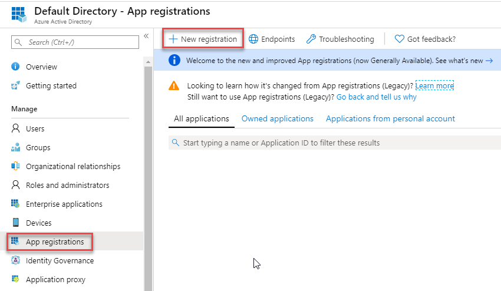
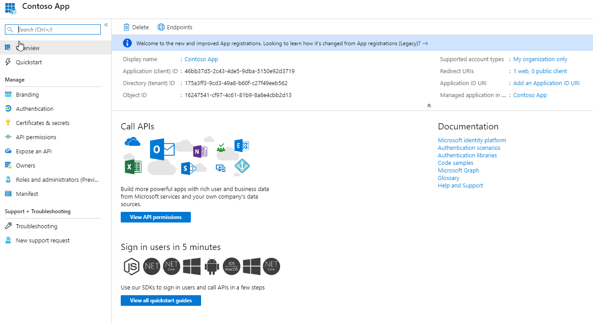

# Module 1: Lab 4: App Registration

**Scenario**

Enterprise developers and software-as-a-service (SaaS) providers can develop commercial cloud services or line-of-business applications that can be integrated with Microsoft identity platform to provide secure sign-in and authorization for their services.

This lab shows you how to add and register an application using the App registrations experience in the Azure portal so that your app can be integrated with the Microsoft identity platform.

## Exercise 1: Application Registration

### Task 1: Register a new application using the Azure portal

1.  Sign in to the Azure portal.

1.  In the left-hand navigation pane, select the **Azure Active Directory** service, and then select **App registrations > New registration**.

     

1.  When the **Register an application** page appears, enter your application's registration information:

       - **Name** - Enter: **Contoso App**
       - **Supported account types** - Select **Accounts in this organizational directory only** (Read the options below).

       | Supported account types | Description |
       |-------------------------|-------------|
       | **Accounts in this organizational directory only** | Select this option if you're building a line-of-business (LOB) application. This option is not available if you're not registering the application in a directory.  This option maps to Azure AD only single-tenant.  This is the default option unless you're registering the app outside of a directory. In cases where the app is registered outside of a directory, the default is Azure AD multi-tenant and personal Microsoft accounts. |
       | **Accounts in any organizational directory** | Select this option if you would like to target all business and educational customers.  This option maps to an Azure AD only multi-tenant.  If you registered the app as Azure AD only single-tenant, you can update it to be Azure AD multi-tenant and back to single-tenant through the **Authentication** blade. |
       | **Accounts in any organizational directory and personal Microsoft accounts** | Select this option to target the widest set of customers.  This option maps to Azure AD multi-tenant and personal Microsoft accounts.  If you registered the app as Azure AD multi-tenant and personal Microsoft accounts, you cannot change this in the UI. Instead, you must use the application manifest editor to change the supported account types. |

       - **Redirect URI (optional)** - Select **Web**, and then enter **`https://app.contoso.com`**
         - For web applications, provide the base URL of your app. For example, `http://localhost:31544` might be the URL for a web app running on your local machine. Users would use this URL to sign in to a web client application.
         - For public client applications, provide the URI used by Azure AD to return token responses. Enter a value specific to your application, such as `myapp://auth`.
 

1.  When finished, select **Register**.

1.  Azure AD assigns a unique application (client) ID to your app, and you're taken to your application's **Overview** page. To add additional capabilities to your application, you can select other configuration options including branding, certificates and secrets, API permissions, and more.

     
 

**Results**: You have now completed this lab.

