# Module 1: Lab 7: Azure Policy

In this lab, you will learn to use Azure Policy to do some of the more common tasks related to creating, assigning, and managing policies across your organization, such as:

> - Assign a policy to enforce a condition for resources you create in the future

## Exercise 1: Using Azure Policy

In this exercise, you will learn the basics of using Azure Policy. You will use a built-in policy to restrict which Azure regions can be used. You will then verify that the policy is working.

### Task 1: Create an Azure Policy Assignment

In this task, you will first browse the built-in policy definitions using the Azure portal. You will then create a policy assignment using one of the built-in definitions to restrict which Azure Regions can be used. This policy will be scoped to the Test-RG resource group.

1.  Log in to the Azure portal at `https://portal.azure.com` using your Azure subscription credentials.

1.  Open the Cloud Shell in PowerShell Mode and run the following command to create a Resource Group in the UK South region.

    ```powershell
    New-AzResourceGroup -Name myResourceGroup -Location UKSouth
    ```

    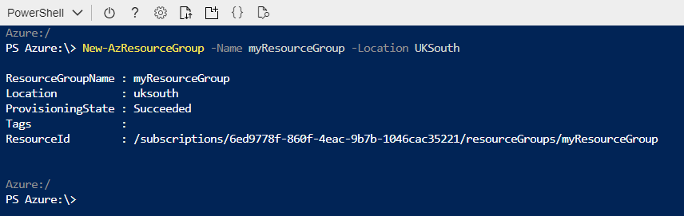

   

2.  In the Hub menu, click on **All services**. Enter **Policy** into the search box, and click on the **Policy** service.

    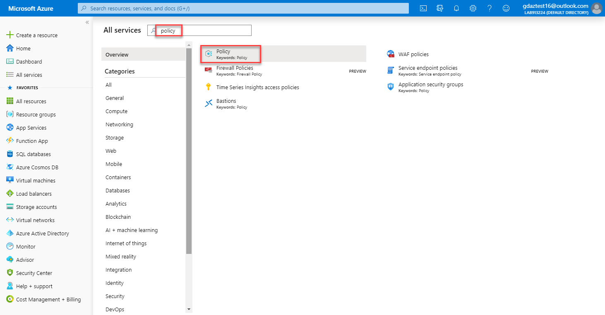


3.  The Azure Policy blade will open. Click on **Definitions** to show the list of available policy definitions.

    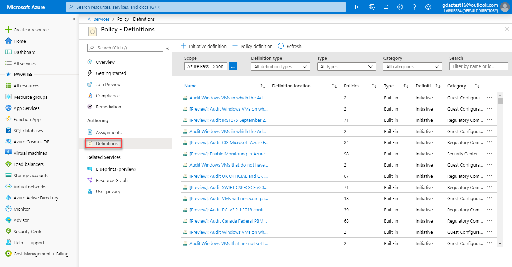


4.  Use the filters and search to find the policy definition called **Allowed locations**.

    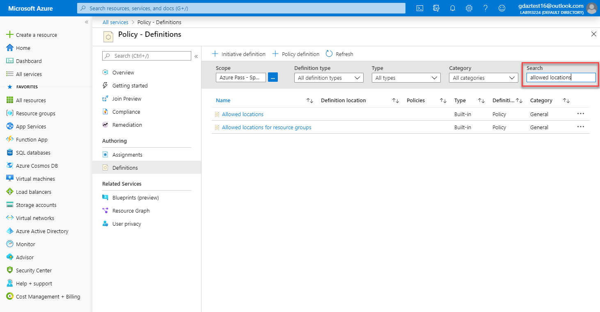


    **Note:** This policy only restricts resource locations, not resource group locations. There is a separate policy for 'Allowed locations for resource groups'.


5.  Click on the **Allowed locations** policy definition to open the definition details view. 

    **Note**: Policy definitions take an array of locations as parameters. A policy rule is an ‘if-then’ statement. The ‘if’ clause checks to see if the resource location is included in the parameterized list, and if not the ‘then’ clause denies the resource creation.

     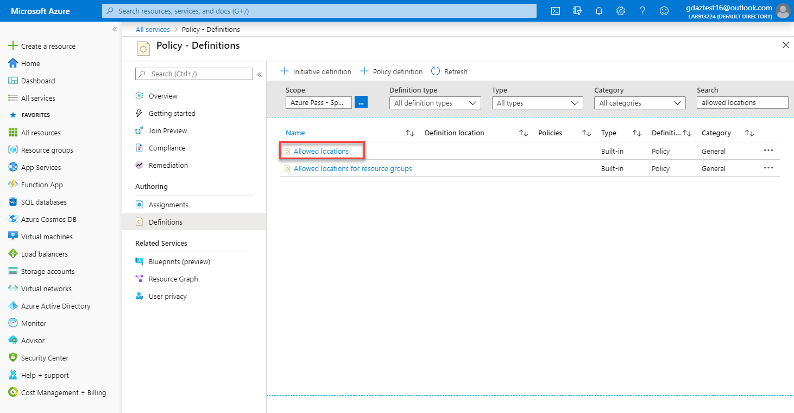


1.  Click **Assign**.

     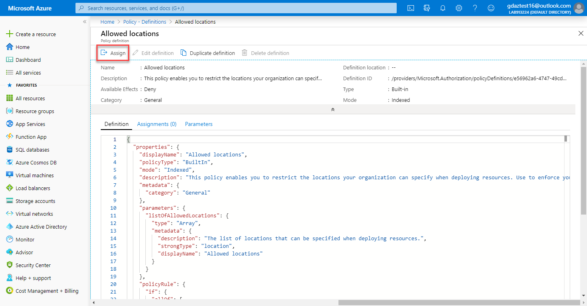


2.  Click the Elipsis (...) button and assign the policy to your Subscription and the **myResourceGroup** resource group then click **Select**.

     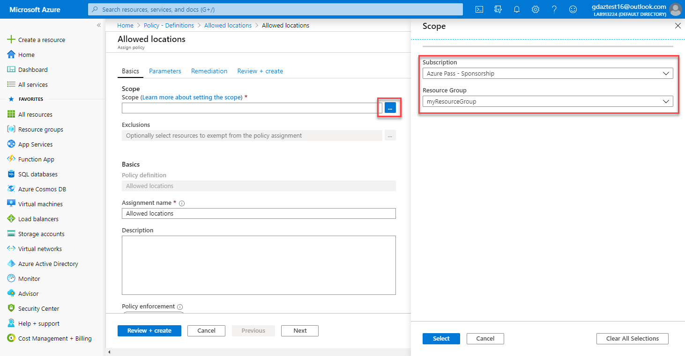


3.  Complete the remainder of the policy assignment **Basics** tab with the following settings:

    -   Exclusions: **Leave blank**
    -   Assignment name: **Allow UK South for myResourceGroup**
    -   Description: **Allow resources to be created in UK South Only for myResourceGroup**
    -   Policy enforcement: **Enabled**
    -   Assigned by: **Your name**


1.  Click **Next** to proceed to the **Parameters** tab. In this tab you can  provide values for parameters that are specified in the policy defintion. Select **UK South** as the allowed location.

     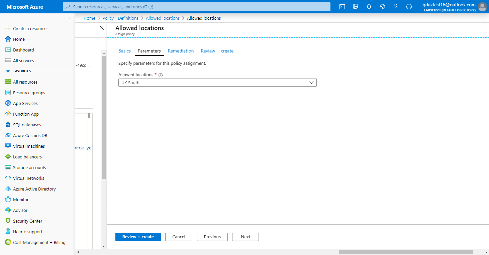


2.  Click **Review + create**, followed by **Create** to create the policy assignment. 

4.  You will see a notification that the assignment was successful, and that the assignment will take around 30 minutes to complete.

    **Note:** The reason the Azure policy assignment takes up to 30 minutes to be assigned is that is has to replicate globally although in the real world it generally only takes 2 - 3 minutes to be implemented.  If the next task fails, simply wait a few minutes and attempt the steps again.

### Task 2: Verify the Azure Policy Assignment

In this task, you will verify that the policy assignment created in the previous task is effective by attempting to create a virtual network in both a permitted region and a different region.

1.  Click **Virtual Networks** on the Hub menu.

2.  On the **Virtual Networks** blade, click **+ Add**
3.  First, you will try to create a virtual network in East US. Since this is not an allowed location, the request should be blocked. Complete in the **Create virtual network** blade as follows:

    -   Name: **myVnet**
    -   Address space: **10.0.0.0/16**
    -   Resource group: **myResourceGroup**
    -   Location: **East US**
    -   Address range: **10.0.0.0/24**

    Leave the other settings at their default values and click **Review + create**.

    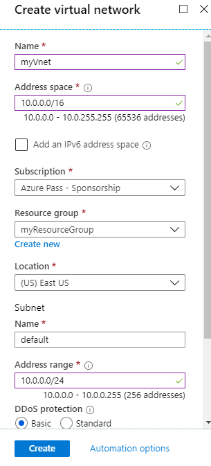
  
4.  Once you click create you will see a validation error. Click the error to open the error details.

    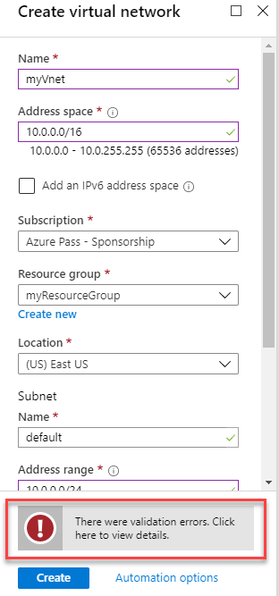


5.  You will see the error states you are disallowed by policy.

    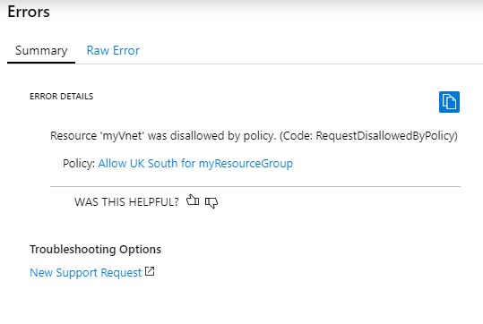


5.  Return back to the Basics tab and change the resource location to **UK South** as this is the location permitted by the policy. Click **Review + create** again and verify that the operation is successful.

**Summary**

In this exercise, you learned to use Azure policy by browsing the built-in policy definitions and creating a policy assignment.

**Results**: You have now completed this lab.

