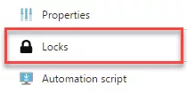
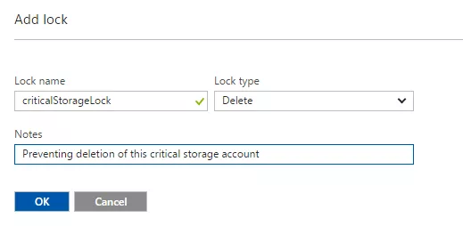

# Module 1: Lab 8: Protecting Azure Resources with Resource Manager Locks


**Scenario**

Resource Manager Locks provide a way for administrators to lock down Azure resources to prevent deletion or changing of a resource. These locks sit outside of the Role Based Access Controls (RBAC) hierarchy and when applied will place the restriction on the resource for all users. These are very useful when you have an important resource in your subscription which users should not be able to delete or change and can help prevent accidental and malicious changes or deletion.

There are two types of resource locks that can be applied:

 - **CanNotDelete** - This prevents anyone from deleting a resource whilst the lock is in place, however they may make changes to it.
 - **ReadOnly** - As the name suggests, it makes the resource read only, so no changes can be made and it cannot be deleted.
Resource locks can be applied to subscriptions, resource groups or individual resources as required. When you lock Subscription, all resources in that subscription (including ones added later) inherit the same lock. Once applied, these locks impact all users regardless of their roles. If it becomes necessary to delete or change a resource with a lock in place, then the lock will need to be removed before this can occur.

**Permissions**

Permission to set and remove locks requires access to one of the following RBAC permissions:

- `Microsoft.Authorization/*`
- `Microsoft.Authorization/locks/*`

By default, these actions are only available on the Owner and User Access Administrator built in RBAC Roles, however you can add them to custom roles as required. As mentioned, users with these roles are still subject to the locks, but obviously they can remove them if required. Creation and deletion of a lock is tracked in the Azure Activity log.


# Lab 7: Protecting Azure Resources with Resource Manager Locks


Locks can be created both at the time of creation of a resource inside an ARM template, or later using the portal or PowerShell.


## Exercise 1: Creating Locks


The best way to ensure that locks are in place and protecting your resources is to create them at run time and configure them in your ARM templates. Locks are top level ARM resources; they do not sit underneath the resource being locked. They refer to the resource being locked, so this must exist first. 


### Task 1: Adding a Lock (Portal)

1.  Open the Cloud Shell (PowerShell) and run the following commands to create a Resource Group and Storage Account.  _(Change XXXXXX in the command to something unique)_

     ```powershell
     New-AzResourceGroup -Name LockRG -Location EastUS
     ```
    
     ```powershell
     New-AzStorageAccount -ResourceGroupName LockRG -Name XXXXXX -Location  EastUS -SkuName Standard_LRS -Kind StorageV2 
     ```

1.  Locate the Storage Account and select it. In the main blade, click the "Locks" icon

     


1.  Click **Add**

1.  Give the lock a name and description, then select the type, deletion or read only.

     


1.  Click **OK** to save the lock. The resource is now protected.

1.  Remove the lock by simply going back into **Locks**, select the lock and then go to delete.

### Task 2: Adding a Lock (PowerShell)

1.  Open the Cloud Shell (PowerShell) and run the following commands to create a Lock on the Storage Account. _(Change XXXXXX in the command to the name of your Storage Account)_

     ```powershell
     Connect-AzureAD
     ```

     ```powershell
     New-AzResourceLock -LockLevel CanNotDelete -LockName criticalStorageLock -ResourceName XXXXXX -ResourceType Microsoft.Storage/storageAccounts -ResourceGroupName LockRG
     ```

1.  To remove a lock use the following command. _(Change XXXXXX in the command to the name of your Storage Account)_

     ```powershell
     Remove-AzResourceLock -LockName criticalStorageLock -ResourceName  XXXXX -ResourceGroupName LockRG -ResourceType Microsoft.Storage/storageAccounts
     ```
     If prompted to confirm, enter **Y** and press **Enter**

By using Resource Logs you can put in place an extra line of defense against accidental or malicious changing and/or deletion of your most important resources. It's not perfect, as your administrators can still remove these locks, but doing so requires a conscious effort, as the only purpose for removing a lock is to circumvent it. As these locks sit outside of RBAC you can apply them and be sure that they are impacting all your users, regardless of what roles or custom permissions you may have granted them.


**Results**: You have now completed this lab.
