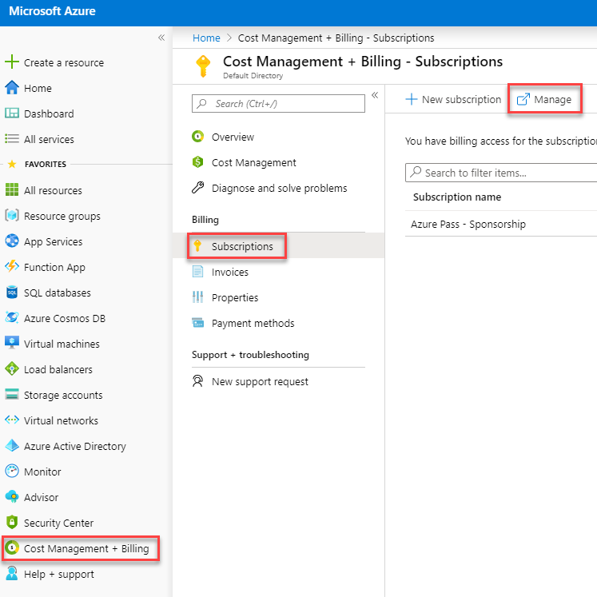
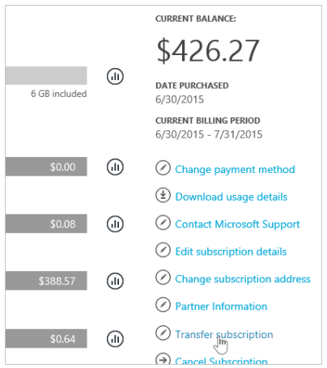
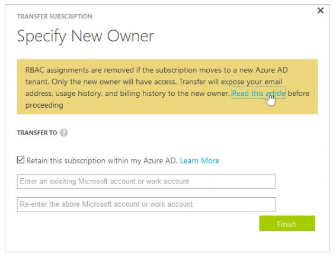
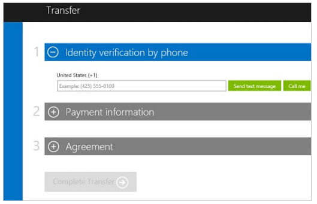

# Module 1: Lab 9: Transferring Subscriptions

**Scenario**

Occasionally, a need arises for transferring a subscription from an owner to an Azure AD tenant. In order to transfer a subscription from an Azure AD owner to another subscription, you need access to another subscription. If you do not have access to multiple subscriptions at this time, just review the process outlined below.

## Exercise 1: Transfer Azure subscriptions between Azure AD tenants

### Task 1: To transfer the ownership of an Azure subscription

1.  Sign in at the Azure Portal as the account admin.

1.  Navigate to **Cost Management + Billing** > **Subscriptions** and click **Manage**.

     

2.  Select your subscription.

3.  Verify that your subscription is eligible for self-serve transfer by checking the Offer and Offer ID against the supported offers list.

    **Note**: At the time of writing, Azure Pass - Sponsorship subscriptions are not eligible for transfer.  Follow this guide through for reference.

4.  Select **Transfer subscription**.

     

5.  Specify the recipient.

    **Note**: If you transfer a subscription to a new Azure AD tenant, all role assignments in RBAC will be permanently deleted from the source tenant and not migrated to the target tenant.

     

6.  The recipient automatically gets an email with an acceptance link.
7.  The recipient selects the link and follows the instructions, including entering their payment information

     

8.  Azure completes the subscription transfer.

 At this point, billing ownership of the Azure subscription would be transfered to the new subscription.

**Results**: You have now completed this module.
