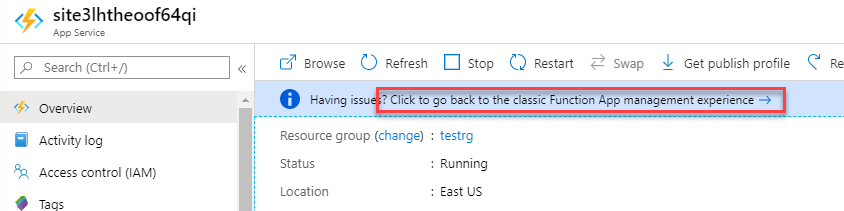
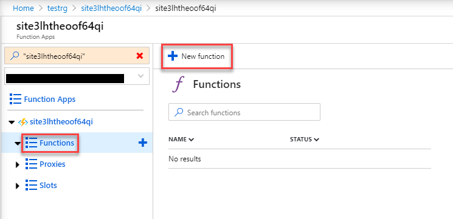

# Module 2: Lab 2 - Function Apps


Azure Function Apps uses the Azure App Service infrastructure. This topic shows you how to create a function app in the Azure portal. A function app is the container that hosts the execution of individual functions. When you create a function app in the App Service hosting plan, your function app can use all the features of App Service.

## Exercise 1: Create a Function and Trigger

### Task 1: Lab Setup

1.  In your browser, navigate to the following URL to open the ARM template:

    ```cli
    https://portal.azure.com/#create/Microsoft.Template/uri/https%3A%2F%2Fraw.githubusercontent.com%2FMicrosoftLearning%2FAZ-500-Azure-Security%2Fmaster%2FAllfiles%2FLabs%2FMod2_Lab02%2Ftemplate.json
    ```

2.  Click **Create new** under the Resource Group section.
3.  Enter **myResourceGroup** as the name and click **OK**.
4.  Select the check box at the bottom of the blade to agree to the terms.
5.  Select **Purchase**


### Task 2: Add a HTTP trigger to your function app

1.  Select **Resource Groups**

1.  Select the resource group you created in the lab setup

1.  Select the function app service that has been created in the resource group

     **Note**: There are no functions currently assigned to the function app

1.  Select **Click to go back to the classic Function App management experience**.

    

1.  Click **Functions**.

2.  Click **+ New Function**.

    

3.  In the top right click the slide button for **Experimental Language support**,

    **Note**: New languages have now been added to the triggers


4.  Select **HTTP trigger**.

5.  Change the language to **PowerShell**.

6.  Leave the name as the default,

7.  Make sure **Authorization** Level is set to **Function**,

8.  Click **Create**.

 You have now created template PS1 HTTP trigger. If the template code does not appear, refresh the page 

### Task 3: Test a REST call to the HTTP trigger

1.  Note the name of the function app (**next to the function app icon**).

1.  Under the **HTTP trigger** function click **Manage**.

1.  Under function keys select **copy** under actions on the default function key and paste this in a notepad file

1.  Navigate to the following URL and copy the PowerShell code
    
    ```cli
    https://raw.githubusercontent.com/godeploy/AZ500/master/AZ500%20Mod2%20Lab%202/RESTgetHTTPtrigger.ps1
    ```

1.  Open a **PowerShell ISE** window and and paste the PowerShell code from the previous **URL**.  *(If the Script pane is not open, select View/Show Script Pane. )*

1.  Populate the variable `$functionappname = ""` with the name of your function app

1.  Populate the variable `$functionkey = ""` with the long function key copied from the portal in the earlier step

1.  Run the powershell script (F5)

1.  In the results in the **ISE** you should see the following output

    ```powershell
    This is result of  a normal GET operation calling your HTTP trigger
    Hello 

    This is result of  a normal GET operation calling your HTTP trigger with an extra parameter passed to the trigger
    Hello World!

    This is result of a normal PUT operation calling your HTTP trigger that feeds a hash table converted to JSON to the HTTP triggger
    Hello Max Power
    ```

**Results**: You have successfully built a HTTP trigger function app and communicated to it using REST based commands.


| WARNING: Prior to continuing you should remove all resources used for this lab.  To do this in the **Azure Portal** click **Resource groups**.  Select any resources groups you have created.  On the resource group blade click **Delete Resource group**, enter the Resource Group Name and click **Delete**.  Repeat the process for any additional Resource Groups you may have created. **Failure to do this may cause issues with other labs.** |
| --- |

**Congratulations**: You have now completed this lab.
