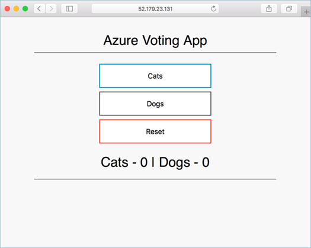

# Module 2: Lab 3 - Create a Kubernetes Cluster


Azure Kubernetes Service (AKS) is a managed Kubernetes service that lets you quickly deploy and manage clusters. In this quickstart, you deploy an AKS cluster using the Azure CLI. A multi-container application that includes a web front end and a Redis instance is run in the cluster. You then see how to monitor the health of the cluster and pods that run your application.

## Exercise 1: Create an AKS environment

### Task 1: Prepare the environment and Create a Resource Group.

1.  Open a browser and navigate to the **Azure Portal** **`https://portal.azure.com`**

1.  Click **Cloudshell** icon.

     

1.  Select **Azure CLI BASH** if required and create a storage account.

1.  Run the following command in the **Cloud Shell** to create a new **Resource Group.**

    ```bash
    az group create --name myAKSResourceGroup --location eastus
    ```

     **Note**: If you receive an error regarding the ```Microsoft.Network``` resource provider not being registered then run the following command and rerun the command in Step 4. Otherwise continue to Task 2.
     
    ```bash
    az provider register --namespace 'Microsoft.Network'
    ```

### Task 2: Create the AKS Cluster in CLI

1.  Run the following command in the **CloudShell**.

    ```bash
    az aks create  --resource-group myAKSResourceGroup --name myAKSCluster --node-count 1 --enable-addons monitoring --generate-ssh-keys
    ```
 
2.  After a few minutes, the command completes and returns **JSON-formatted** information about the cluster.

### Task 3: Connect to the cluster


To manage a Kubernetes cluster, you use kubectl, the Kubernetes command-line client. If you use Azure Cloud Shell, `kubectl` is already installed.


1.  Open **Azure Cloud Shell** in Bash mode.


1.  To configure `kubectl` to connect to your **Kubernetes cluster**, use the az-aks-get-credentials command. This command downloads credentials and configures the **Kubernetes CLI** to use them.


    ```azurecli-interactive
    az aks get-credentials --resource-group myAKSResourceGroup --name myAKSCluster
    ```

1.  To verify the connection to your cluster, use the kubectl-get command to return a list of the cluster nodes.


    ```azurecli-interactive
    kubectl get nodes
    ```

1.  The following example output shows the single node created in the previous steps. Make sure that the status of the node is *Ready*:

    ```json
    NAME                       STATUS   ROLES   AGE     VERSION
    aks-nodepool1-31718369-0   Ready    agent   6m44s   v1.9.11
    ```

### Task 4: Run the application


A Kubernetes manifest file defines a desired state for the cluster, such as what container images to run. In this lab, a manifest is used to create all objects needed to run the Azure Vote application. This manifest includes two kubernetes-deployment - one for the sample Azure Vote Python applications, and the other for a Redis instance. Two kubernetes-service are also created - an internal service for the Redis instance, and an external service to access the Azure Vote application from the internet. The manifest file has been created and saved to the Godeploy Github page for this lab. The file is azure-vote.yaml and can be found at **`https://raw.githubusercontent.com/MicrosoftLearning/AZ-500-Azure-Security/master/Allfiles/Labs/Mod2_Lab03/azure-vote.yaml`**


1.  Run the following command in the cloud shell, this will directly pull the yaml file needed from GitHub to deploy the AKS application

    ```bash
    kubectl apply -f https://raw.githubusercontent.com/MicrosoftLearning/AZ-500-Azure-Security/master/Allfiles/Labs/Mod2_Lab03/azure-vote.yaml
    ```

2.  The following example output shows the **Deployments and Services** created successfully:

    ```json
    deployment "azure-vote-back" created
    service "azure-vote-back" created
    deployment "azure-vote-front" created
    service "azure-vote-front" created
    ```

**Note**: When the application runs, a Kubernetes service exposes the application front end to the internet. This process can take a few minutes to complete.


### Task 5: Test the application


1.  To monitor progress, use the kubectl-get command with the `--watch` argument.

    ```azurecli-interactive
    kubectl get service azure-vote-front --watch
    ```

1.  Initially the *EXTERNAL-IP* for the *azure-vote-front* service is shown as *pending*.

    ```
    NAME               TYPE           CLUSTER-IP   EXTERNAL-IP   PORT(S)         AGE
    azure-vote-front   LoadBalancer   10.0.37.27   <pending>     80:30572/TCP    6s
    ```


1.  When the *EXTERNAL-IP* address changes from *pending* to an actual public IP address, use `CTRL-C` to stop the `kubectl` watch process. The following example output shows a valid public IP address assigned to the service:

    ```
    azure-vote-front   LoadBalancer   10.0.37.27   52.179.23.131   80:30572/    TCP   2m
    ```

2.  To see the Azure Vote app in action, open a web browser to the external IP address of your service as shown in the result of the previous command.

     


### Task 6: Monitor health and logs


When the AKS cluster was created, Azure Monitor for containers was enabled to capture health metrics for both the cluster nodes and pods. These health metrics are available in the Azure portal.


To see current status, uptime, and resource usage for the Azure Vote pods, complete the following steps:

1.  Open a web browser to the Azure portal.

1.  Select your resource group, such as *myAKSResourceGroup*, then select your AKS cluster, such as *myAKSCluster*.
1.  Under **Monitoring** on the left-hand side, choose **Insights**
1.  Across the top, choose to **+ Add Filter**
1.  Select *Namespace* as the property, then choose `<All but kube-system>`
1.  Choose to view the **Containers**.

    The *azure-vote-back* and *azure-vote-front* containers are displayed


1.  Click the view live data button then switch to the running application (Cats/Dogs) to click the vote buttons then switch back to view the live data under the Logs window.


### Task 7: Delete the cluster


When the cluster is no longer needed, use the **`az group delete`** command to remove the resource group, container service, and all related resources.


1.  Run the following command in the **Cloud Shell** in Bash mode to delete the Resource Group.

    ```bash
    az group delete --name myAKSResourceGroup --yes --no-wait
    ```

    **Note**:  It may take some time to delete the Resource Group.  The `--no-wait` option runs the command in the background.

**Results**: You have now completed this lab.
