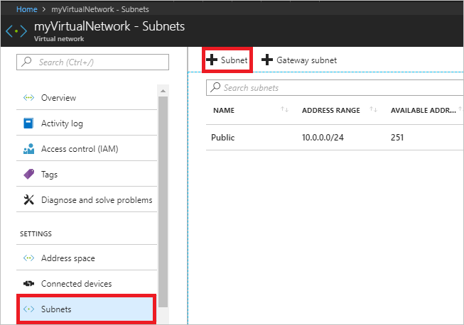
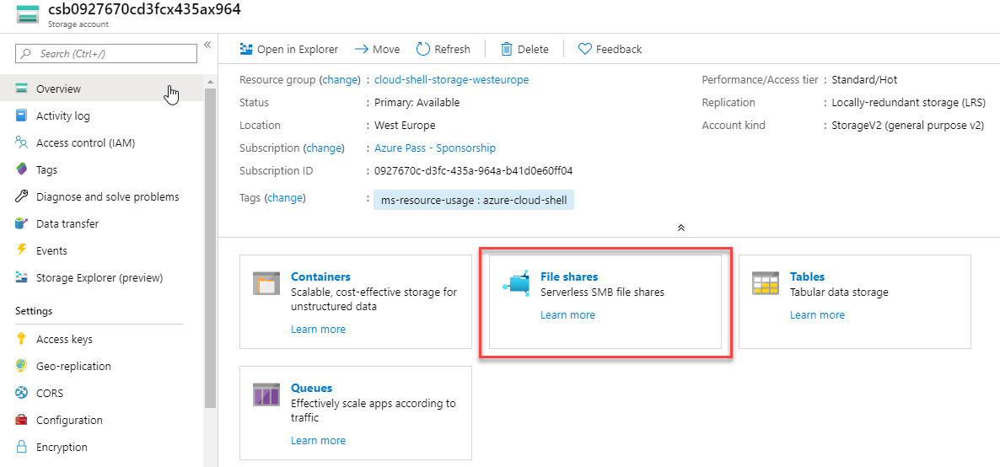

# Module 2: Lab 7: Service Endpoints


Virtual network service endpoints enable you to limit network access to some Azure service resources to a virtual network subnet. You can also remove internet access to the resources. Service endpoints provide direct connection from your virtual network to supported Azure services, allowing you to use your virtual network's private address space to access the Azure services. Traffic destined to Azure resources through service endpoints always stays on the Microsoft Azure backbone network. In this tutorial, you learn how to:

- Create a virtual network with one subnet
- Add a subnet and enable a service endpoint
- Create an Azure resource and allow network access to it from only a subnet
- Deploy a virtual machine (VM) to each subnet
- Confirm access to a resource from a subnet
- Confirm access is denied to a resource from a subnet and the internet


## Exercise 1: Restrict network access to PaaS resources with virtual network service endpoints using the Azure portal

### Task 1: Create a virtual network

1.  Select **+ Create a resource** on the upper left corner of the Azure portal.
2.  Select **Networking**, and then select **Virtual network**.
3.  Enter, or select, the following information, and then select **Review + create**, then click **Create**:

    |Setting|Value|
    |----|----|
    |Subscription| Select your subscription|
    |Resource group | Select **Create new** and enter *myResourceGroup*.|
    |Name| myVirtualNetwork |  
    |Location| Select **East US** |
    
    Select the IP Addresses tab and enter the following values:
    
    |Setting|Value|
    |----|----|
    |Address space| 10.0.0.0/16|    
    |Subnet Name| Public|
    |Subnet Address range| 10.0.0.0/24|
    
    Select the Security tab and enter the following values:

    |Setting|Value|
    |----|----|
    |DDoS protection| Basic|
    |Firewall| Disabled|


### Task 2: Enable a service endpoint


Service endpoints are enabled per service, per subnet. Create a subnet and enable a service endpoint for the subnet.


1.  In the **Search resources, services, and docs** box at the top of the portal, enter *myVirtualNetwork.* When **myVirtualNetwork** appears in the search results, select it.
2.  Add a subnet to the virtual network. Under **SETTINGS**, select **Subnets**, and then select **+ Subnet**, as shown in the following picture:

       

3.  Under **Add subnet**, select or enter the following information, and then select **OK**:

    |Setting|Value|
    |----|----|
    |Name| Private |
    |Address range| 10.0.1.0/24|
    |Service endpoints| Select **Microsoft.Storage** under **Services**|

### Task 3: Restrict network access for a subnet


By default, all VMs in a subnet can communicate with all resources. You can limit communication to and from all resources in a subnet by creating a network security group and associating it to the subnet.


1.  Select **+ Create a resource** on the upper left corner of the Azure portal.
2.  Select **Networking**, and then select **Network security group**.
3.  Under **Create a network security group**, enter, or select, the following information, and then select **Review + create**, then click **Create**:

    |Setting|Value|
    |----|----|
    |Name| myNsgPrivate |
    |Subscription| Select your subscription|
    |Resource group | Select **Use existing** and select *myResourceGroup*.|
    |Location| Select **East US** |

4.  After the network security group is created, enter *myNsgPrivate* in the **Search resources, services, and docs** box at the top of the portal. When **myNsgPrivate** appears in the search results, select it.
5.  Under **SETTINGS**, select **Outbound security rules**.
6.  Select **+ Add**.
7.  Create a rule that allows outbound communication to the Azure Storage service. Enter, or select, the following information, and then select **Add**:

    |Setting|Value|
    |----|----|
    |Source| Select **VirtualNetwork** |
    |Source port ranges| * |
    |Destination | Select **Service Tag**|
    |Destination service tag | Select **Storage**|
    |Destination port ranges| * |
    |Protocol|Any|
    |Action|Allow|
    |Priority|100|
    |Name|Allow-Storage-All|

8.  Create another outbound security rule that denies communication to the internet. This rule overrides a default rule in all network security groups that allows outbound internet communication. Complete steps 5-7 again, using the following values:

    |Setting|Value|
    |----|----|
    |Source| Select **VirtualNetwork** |
    |Source port ranges| * |
    |Destination | Select **Service Tag**|
    |Destination service tag| Select **Internet**|
    |Destination port ranges| * |
    |Protocol|Any|
    |Action|Deny|
    |Priority|110|
    |Name|Deny-Internet-All|

9.  Under **SETTINGS**, select **Inbound security rules**.
10.  Select **+ Add**.
11.  Create an inbound security rule that allows Remote Desktop Protocol (RDP) traffic to the subnet from anywhere. The rule overrides a default security rule that denies all inbound traffic from the internet. Remote desktop connections are allowed to the subnet so that connectivity can be tested in a later step. Under **SETTINGS**, select **Inbound security rules**, select **+Add**, enter the following values, and then select **Add**:

   |Setting|Value|
   |----|----|
   |Source| Any |
   |Source port ranges| * |
   |Destination | Select **VirtualNetwork**|
   |Destination port ranges| 3389 |
   |Protocol|Any|
   |Action|Allow|
   |Priority|120|
   |Name|Allow-RDP-All|

12.  Under **SETTINGS**, select **Subnets**.
13.  Select **+ Associate**
14.  Under **Associate subnet**, select **Virtual network** and then select **myVirtualNetwork** under **Choose a virtual network**.
15.  Under **Choose subnet**, select **Private**, and then select **OK**.

### Task 4: Restrict network access to a resource


The steps necessary to restrict network access to resources created through Azure services enabled for service endpoints varies across services. See the documentation for individual services for specific steps for each service. The remainder of this tutorial includes steps to restrict network access for an Azure Storage account, as an example.


1.  Select **+ Create a resource** on the upper left corner of the Azure portal.
2.  Select **Storage**, and then select **Storage account - blob, file, table, queue**.
3.  Enter, or select, the following information, accept the remaining defaults, and then select **Review + create**, then click **Create**:

    |Setting|Value|
    |----|----|
    |Name| Enter a name that is unique across all Azure locations, between 3-24 characters in length, using only numbers and lower-case letters.|
    |Account kind|StorageV2 (general purpose v2)|
    |Location| Select **East US** |
    |Replication| Locally-redundant storage (LRS)|
    |Subscription| Select your subscription|
    |Resource group | Select **Use existing** and select *myResourceGroup*.|

### Task 5: Create a file share in the storage account

1.  After the storage account is created, enter the name of the storage account in the **Search resources, services, and docs** box, at the top of the portal. When the name of your storage account appears in the search results, select it.
2.  Select **File shares**, as shown in the following picture:

       

3.  Select **+ File share**.
4.  Enter *my-file-share* under **Name**, and then select **Create**.
5.  Close the **File service** box.

### Task 6: Restrict network access to a subnet


By default, storage accounts accept network connections from clients in any network, including the internet. Deny network access from the internet, and all other subnets in all virtual networks, except for the *Private* subnet in the *myVirtualNetwork* virtual network.


1.  Under **SETTINGS** for the storage account, select **Firewalls and virtual networks**.
2.  Select **Selected networks**.
3.  Select **+Add existing virtual network**.
4.  Under **Add networks**, select the following values, and then select **Add**:

    |Setting|Value|
    |----|----|
    |Subscription| Select your subscription.|
    |Virtual networks|Select **myVirtualNetwork**, under **Virtual networks**|
    |Subnets| Select **Private**, under **Subnets**|


5.  Select **Save**.
6.  Close the **Firewalls and virtual networks** box.
7.  Under **SETTINGS** for the storage account, select **Access keys**.

8.  Note the **Key** value, as you'll have to manually enter it in a later step when mapping the file share to a drive letter in a VM.

### Task 7: Create virtual machines


To test network access to a storage account, deploy a VM to each subnet.


1.  Select **+ Create a resource** found on the upper left corner of the Azure portal.
2.  Select **Compute**, and then select **Virtual Machine**.
3.  Enter, or select, the following information and then select **OK**:

    |Setting|Value|
    |----|----|
    |Name| myVmPublic|
    |User name|Enter a user name of your choosing.|
    |Password| Pa55w.rd1234 |
    |Subscription| Select your subscription.|
    |Resource group| Select **Use existing** and select **myResourceGroup**.|
    |Location| Select **East US**.|
    |Image| Select **Windows Server 2019 Datacenter**.|

   
4.  Select a size for the virtual machine and then select **Select**.
5.  On the **Networking** tab select **myVirtualNetwork**. Then select **Subnet**, and select the **Public** subnet.

   
6.  Under **Network Security Group**, select **Basic** and allow port 3389. 

1.  Click **Review + create**.

7.  On the **Summary** page, select **Create** to start the virtual machine deployment. The VM takes a few minutes to deploy, but you can continue to the next step while the VM is creating.

1.  Complete steps 1-8 again, but in step 3, name the virtual machine *myVmPrivate* and in step 5, select the **Private** subnet.

The VM takes a few minutes to deploy. Do not continue to the next step until it finishes creating and its settings open in the portal.

### Task 8: Confirm access to storage account

1.  Once the myVmPrivate VM finishes creating, open the blade for the VM by selecting **Go to resource**.  Select the **Connect** button, then select RDP.

2.  After selecting the **Connect** button and RDP, select the Download RDP File button.  A Remote Desktop Protocol (.rdp) file is created and downloaded to your computer.  
3.  Open the downloaded rdp file. If prompted, select **Connect**. Enter the user name and password you specified when creating the VM. You may need to select **More choices**, then **Use a different account**, to specify the credentials you entered when you created the VM. 
4.  Select **OK**.
5.  You may receive a certificate warning during the sign-in process. If you receive the warning, select **Yes** or **Continue** to proceed with the connection.
6.  On the *myVmPrivate* VM, map the Azure file share to drive Z using PowerShell. Before running the commands that follow, replace `<storage-account-key>` and `<storage-account-name>` with values you supplied and retrieved in the **Create a storage account** task.

    ```powershell
    $acctKey = ConvertTo-SecureString -String "<storage-account-key>" -AsPlainText -Force
    $credential = New-Object System.Management.Automation.PSCredential -ArgumentList "Azure\<storage-account-name>", $acctKey
    New-PSDrive -Name Z -PSProvider FileSystem -Root "\\<storage-account-name>.file.core.windows.net\my-file-share"  -Credential $credential
    ```

     The Azure file share successfully mapped to the Z drive.

7.  Confirm that the VM has no outbound connectivity to the internet from a command prompt:

    ```
       ping bing.com
    ```

    You receive no replies because the network security group associated to the *Private* subnet does not allow outbound access to the internet.

8.  Close the remote desktop session to the *myVmPrivate* VM.

### Task 9: Confirm access is denied to storage account

1.  Enter *myVmPublic* In the **Search resources, services, and docs** box at the top of the portal.
2.  When **myVmPublic** appears in the search results, select it.
3.  Complete steps 1-6 in the Confirm access to storage account task for the *myVmPublic* VM.

       After a short wait, you receive a `New-PSDrive : Access is denied` error. Access is denied because the *myVmPublic* VM is deployed in the *Public* subnet. The *Public* subnet does not have a service endpoint enabled for Azure Storage. The storage account only allows network access from the *Private* subnet, not the *Public* subnet.

4.  Close the remote desktop session to the *myVmPublic* VM.

5.  From your computer, browse to the Azure portal.
6.  Enter the name of the storage account you created in the **Search resources, services, and docs** box. When the name of your storage account appears in the search results, select it.
7.  Select **File shares** then select *my-file-share*.
8.  You receive the error shown in the following screenshot:

      

      Access is denied, because your computer is not in the *Private* subnet of the *MyVirtualNetwork* virtual network.


| WARNING: Prior to continuing you should remove all resources used for this lab.  To do this in the **Azure Portal** click **Resource groups**.  Select any resources groups you have created.  On the resource group blade click **Delete Resource group**, enter the Resource Group Name and click **Delete**.  Repeat the process for any additional Resource Groups you may have created. **Failure to do this may cause issues with other labs.** |
| --- |

**Results** : You have now completed this lab.
