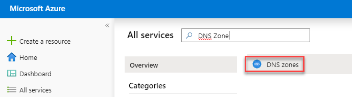
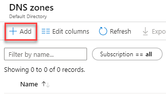
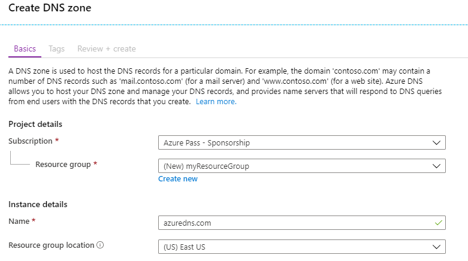
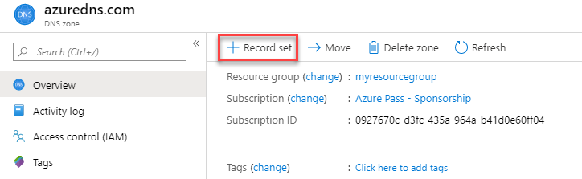
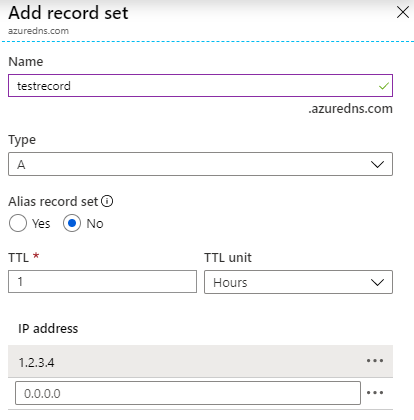
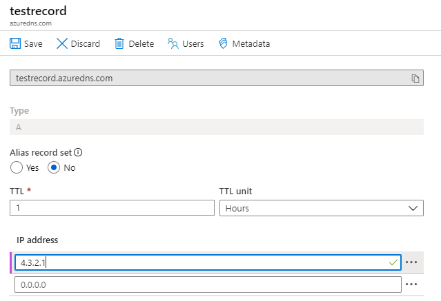
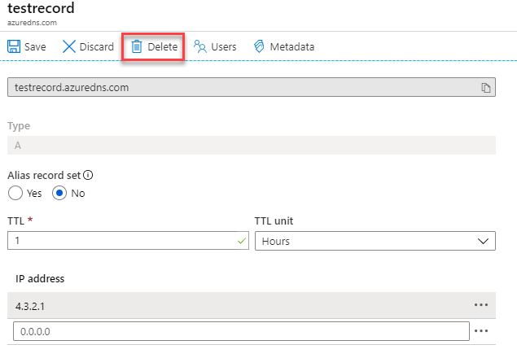

# Lab 9: Azure DNS

**Scenario**

In this module, you will learn about DNS basics and specifically implementing Azure DNS. In the DNS Basics lesson you will review DNS domains, zones, record types, and resolution methods. In the Azure DNS lesson, we will cover delegation, metrics, alerts, and DNS hosting schemes. 

**Objectives**

Lessons include:

 * Azure DNS Basics
 * Implementing Azure DNS

## Exercise 1: DNS Zones

### Task 1: Create a DNS zone

1.  Sign in to the Azure Portal.
2.  On the Hub menu, click **All services** and search for and select **DNS zones**.

     

1. Click **+ Add**.

     

4.  On the **Create DNS zone** blade enter the following values, then click **Review + create** and then click **Create**:

     | **Setting** | **Value** | **Details** |
     |------|---|---|
     |**Subscription**|_**Your subscription**_|Select a subscription to   create the DNS zone in.|
     |**Resource group**|Create new: **_myResourceGroup_**|Create a resource  group. The resource group name must be unique within the subscription  you selected. 
     |**Name**|**_see details**_|The name of the DNS zone (yours must be  unique) |
     |**Location**|East US||

     

## Exercise 2: Manage DNS records and record sets by using the Azure portal

This exercise shows you how to manage record sets and records for your DNS zone by using the Azure portal.

### Task 1: Add a new record to a record set

1.  In the Azure Portal, navigate to **All resources** and select your DNS zone you created in the previous task.

    **Note:** Each DNS zone is its own resource, and information such as number of record-sets and name servers are viewable from this view. 

 
3.  Click **+ Record Set**.
 
     

4.  Enter **testrecord** for the name and **1.2.3.4** as the IP address and click **OK**.

     

### Task 2: Update a record

1.  In the Overview blade for your DNS zone, select the testrecord you created.

      
 
2.  Under IP Address add the test address of **4.3.2.1** and click **Save**.

     
 
### Task 3: Remove a record from a record set

You can use the Azure portal to remove records from a record set. Note that removing the last record from a record set does not delete the record set.

1.  In the Overview pane for your DNS zone, select the testrecord you created.

     

2.  Select **Delete** and click **Yes** when prompted.

      
 

**Work with NS and SOA records**

NS and SOA records that are automatically created are managed differently from other record types.

**Modify SOA records**

You cannot add or remove records from the automatically created SOA record set at the zone apex (name = "\@"). However, you can modify any of the parameters within the SOA record (except "Host") and the record set TTL.

**Modify NS records at the zone apex**

The NS record set at the zone apex is automatically created with each DNS zone. It contains the names of the Azure DNS name servers assigned to the zone.

You can add additional name servers to this NS record set, to support co-hosting domains with more than one DNS provider. You can also modify the TTL and metadata for this record set. However, you cannot remove or modify the pre-populated Azure DNS name servers.

Note that this applies only to the NS record set at the zone apex. Other NS record sets in your zone (as used to delegate child zones) can be modified without constraint.

**Delete SOA or NS record sets**

You cannot delete the SOA and NS record sets at the zone apex (name = "\@") that are created automatically when the zone is created. They are deleted automatically when you delete the zone.

You are then prompted to confirm you are wanting to delete the DNS zone. Deleting a DNS zone also deletes all records that are contained in the zone.

| WARNING: Prior to continuing you should remove all resources used for this lab.  To do this in the **Azure Portal** click **Resource groups**.  Select any resources groups you have created.  On the resource group blade click **Delete Resource group**, enter the Resource Group Name and click **Delete**.  Repeat the process for any additional Resource Groups you may have created. **Failure to do this may cause issues with other labs.** |
| --- |
