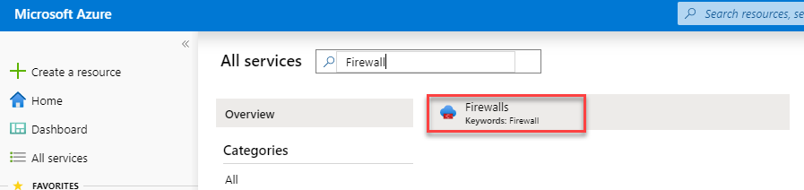
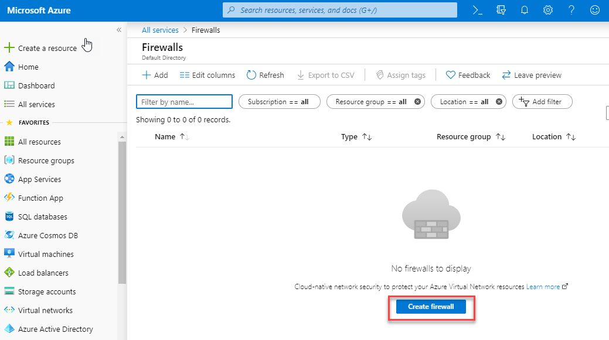
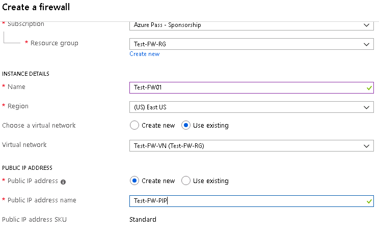
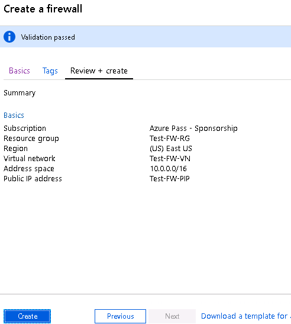
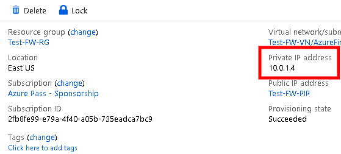

# Module 2: Lab 12 - Azure Firewall


**Scenario**

Controlling outbound network access is an important part of an overall network security plan. For example, you may want to limit access to web sites, or the outbound IP addresses and ports that can be accessed.

One way you can control outbound network access from an Azure subnet is with Azure Firewall. With Azure Firewall, you can configure:

* Application rules that define fully qualified domain names (FQDNs) that can be accessed from a subnet.
* Network rules that define source address, protocol, destination port, and destination address.

Network traffic is subjected to the configured firewall rules when you route your network traffic to the firewall as the subnet default gateway.

## Exercise 1: Deploy an Azure Firewall

### Task 1: Lab Setup

1.  In your browser, navigate to the following URL to open the ARM template:

    ```cli
    https://portal.azure.com/#create/Microsoft.Template/uri/https%3A%2F%2Fraw.githubusercontent.com%2FGoDeploy%2FAZ500%2Fmaster%2FAZ500%20Mod2%20Lab%207%2Ftemplate.json
    ```
 
2.  Click **Create new** under the Resource Group and use the resource group name of **Test-FW-RG**  

3.  Select the loction of **East US**  

4.  Leave all the other fields as the pre-populated defaults

5.  Select the I agree.... check box and click **Purchase** and wait for the deployment to complete.

    This lab setup template will set up the following resources for the lab

      |Name     |Type     | Location|
     |---------|---------|---------|
     azureFirewalls-ip|	Public IP address|	East US	
     Firewall-route |	Route table|	East US	
     Srv-Jump|	Virtual machine|	East US	
     Srv-Jump_OsDisk|	Disk|	East US	
     srv-jump121	|Network interface|	East US	
     Srv-Jump-nsg|	Network security group|	East US	
     Srv-Jump-PIP|	Public IP address|	East US	
     Srv-Work|	Virtual machine|	East US	
     Srv-Work_OsDisk_1 |	Disk|	East US	
     srv-work267|	Network interface|	East US	
     Srv-Work-nsg|	Network security group|	East US	
     Test-FW-VN|	Virtual network|	East US


### Task 2: Deploy the firewall


In this task you will deploy the Azure firewall into the VNet.


1.  In the Azure portal, click **All services** and search for and select **Firewalls**.

     

3.  On the **Firewalls** blade click **Create firewall**. 

     

4.  On the **Create a Firewall** blade, use the following table to configure the firewall:

     |Setting  |Value  |
     |---------|---------|
     |Subscription     |_your subscription_|
     |Resource group     |**Use existing**: Test-FW-RG |
     |Name     |Test-FW01|
     |Location     |East US|
     |Choose a virtual network     |**Use existing**: Test-FW-VN|
     |Public IP address     |**Add new**. **TEST-FW-PIP** The Public IP address must be the Standard SKU type.|
   
     

5.  Click **Review + create**.
6.  Review the summary, and then click **Create** to create the firewall.

     

    This will take a few minutes to deploy.

7.  After the deployment completes, go to the **Test-FW-RG** resource group, and click the **Test-FW01** firewall.

8.  Make a note of the **Private IP** address. You'll use it later when you create the default route.

     

### Task 3: Create a default route


For the **Workload-SN** subnet, configure the outbound default route to go through the firewall.


1.  From the Azure portal home page, click **All services**.
2.  Under **Networking**, click **Route tables**.
3.  Click **Add**.
4.  For **Name**, type **Firewall-route**.
5.  For **Subscription**, select your subscription.
6.  For **Resource group**, select **Use existing**, and select **Test-FW-RG**.
7.  For **Location**, select **East US**.
8.  Click **Create**.
9.  Click **Refresh**, and then click the **Firewall-route** route table.
10.  Click **Subnets** > **Associate**.
11.  Click **Virtual network** > **Test-FW-VN**.
12.  For **Subnet**, click **Workload-SN**. Make sure that you select only the **Workload-SN** subnet for this route, otherwise your firewall won't work correctly.

13.  Click **OK**.
14.  Click **Routes** > **Add**.
15.  For **Route name**, type **FW-DG**.
16.  For **Address prefix**, type **0.0.0.0/0**
17.  For **Next hop type**, select **Virtual appliance**.

        Azure Firewall is actually a managed service, but virtual appliance works in this situation.

18.  For **Next hop address**, type the private IP address for the firewall that you noted previously.
19.  Click **OK**.

### Task 4: Configure an application rule


In this task you will create an application rule that allows outbound access to `msn.com`.


1.  Open the **Test-FW-RG** resource group and click the **Test-FW01** firewall.

2.  On the **Test-FW01** page, under **Settings** section, click **Rules**.
3.  Click the **Application rule collection** tab.
4.  Click **Add application rule collection**.
5.  For **Name**, type **App-Coll01**.
6.  For **Priority**, type **200**.
7.  For **Action**, select **Allow**.
8.  Under **Rules**, **Target FQDNs**, for **Name**, type **AllowGH**.
9.  For **Source Addresses**, type **10.0.2.0/24**.
10.  For **Protocol:port**, type **http, https**.
11.  For **Target FQDNS**, type **msn.com**
12.  Click **Add**.

 Azure Firewall includes a built-in rule collection for infrastructure FQDNs that are allowed by default. These FQDNs are specific for the platform and can't be used for other purposes. 

### Task 5: Configure a network rule


In this task you will create a network rule that allows outbound access to two IP addresses on port 53 (DNS).


1.  Click the **Network rule collection** tab.
2.  Click **Add network rule collection**.
3.  For **Name**, type **Net-Coll01**.
4.  For **Priority**, type **200**.
5.  For **Action**, select **Allow**.

6.  Under **Rules** in the **IP Addresses** section, for **Name**, type **AllowDNS**.
7.  For **Protocol**, select **UDP**.
8.  For **Source Addresses**, type **10.0.2.0/24**.
9.  For Destination address, type **209.244.0.3,209.244.0.4**
10.  For **Destination Ports**, type **53**.
11.  Click **Add**.

### Task 6: Change the primary and secondary DNS address for the **Srv-Work** network interface


For testing purposes in this tutorial, you configure the primary and secondary DNS addresses. This isn't a general Azure Firewall requirement.


1.  From the Azure portal, open the **Test-FW-RG** resource group.

2.  Click the network interface for the **Srv-Work** virtual machine.

    1.  Under **Settings**, click **Networking**.

    2.  Select the NIC

3.  Under **DNS servers**, click **Custom**.

4.  Type **209.244.0.3** in the **Add DNS server** text box, and **209.244.0.4** in the next text box.

5.  Click **Save** and wait until it has successfully saved.. 

6.  Restart the **Srv-Work** virtual machine.

### Task 7: Test the firewall


In this task you will test the firewall to confirm that it works as expected.


1.  From the Azure portal, review the network settings for the **Srv-Work** virtual machine and note the private IP address.

2.  Connect to the **Srv-Jump** virtual machine using RDP, and from there open a remote desktop connection to the **Srv-Work** private IP address.

    -	**Username**: localadmin
    -	**Password**: Pa55w.rd1234

3.  Open Internet Explorer and browse to **`https://www.msn.com`**

4.  Click **OK** > **Close** on the security alerts.

     You should see the MSN home page.

5.  Browse to **`https://msn.com`**

       - You should be blocked by the firewall.
       - So now you've verified that the firewall rules are working:
          - You can browse to the one allowed FQDN, but not to any others.
          - You can resolve DNS names using the configured external DNS server.

1.  To troubleshoot, go to **Network Watcher**, choose **Topology** then choose **TEST-FW-RG** to see the overall network diagram.

| WARNING: Prior to continuing you should remove all resources used for this lab.  To do this in the **Azure Portal** click **Resource groups**.  Select any resources groups you have created.  On the resource group blade click **Delete Resource group**, enter the Resource Group Name and click **Delete**.  Repeat the process for any additional Resource Groups you may have created. **Failure to do this may cause issues with other labs.** |
| --- |

**Results**: You have now completed this lab.


