# Module 2 - Implement Platform Protection 

## Lab 13 -  Secure Admin Access 


SSH is an encrypted connection protocol that allows secure sign-ins over unsecured connections. SSH is the default connection protocol for Linux VMs hosted in Azure. Although SSH itself provides an encrypted connection, using passwords with SSH connections still leaves the VM vulnerable to brute-force attacks or guessing of passwords. A more secure and preferred method of connecting to a VM using SSH is by using a public-private key pair, also known as SSH keys.

- The public key is placed on your Linux VM, or any other service that you wish to use with public-key cryptography.

- The private key on you local system is used by an SSH client to verify your identity when you connect to your Linux VM. Protect this private key. Do not share it.

- Depending on your organization's security policies, you can reuse a single public-private key pair to access multiple Azure VMs and services. You do not need a separate pair of keys for each VM or service you wish to access.

Your public key can be shared with anyone, but only you (or your local security infrastructure) should possess your private key.

## Exercise 1: Deploy and connect to an Azure VM securely.

### Task 1: Create SSH keys with PuTTYgen

1.  Open a browser and navigate to the following URL:

    ```cli
    http://www.chiark.greenend.org.uk/~sgtatham/putty/download.html 
    ```

1.  Download and install the **Putty Installer**.

     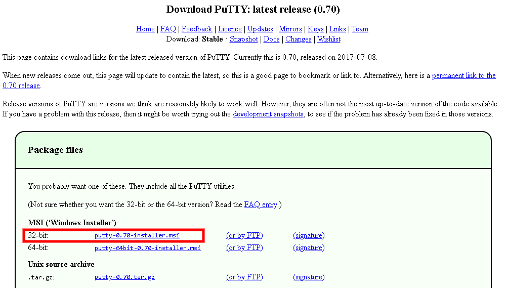

1.  Click **Start** and navigate to **PuTTYgen**.

     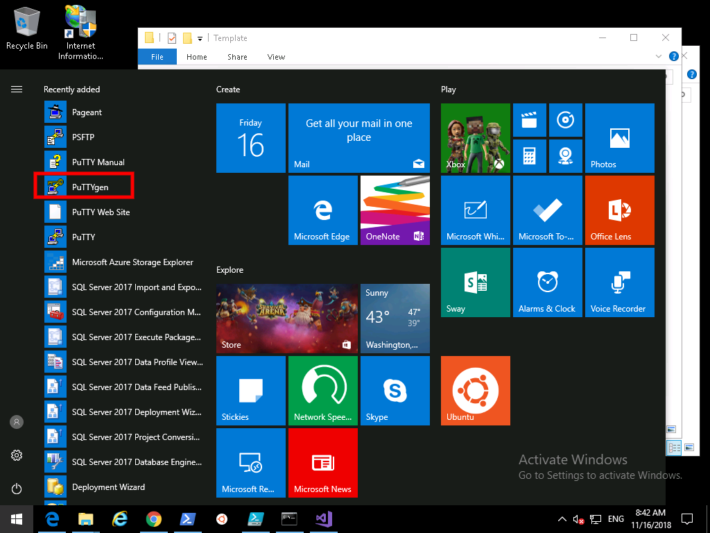

1.  Click Generate. By default PuTTYgen generates a 2048-bit SSH-2 RSA key.

     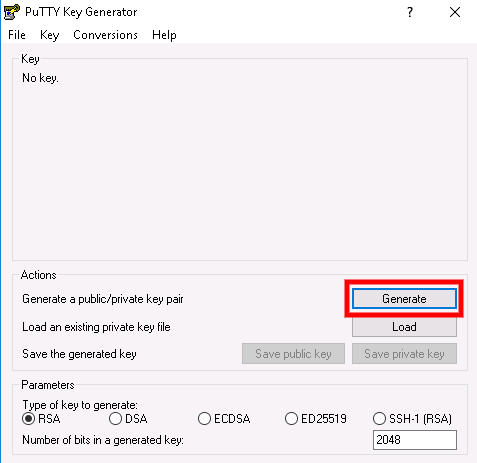

1.  Move the mouse around in the blank area to provide randomness for the key.

     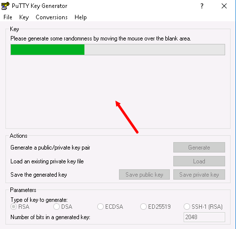

1.  After the public key is generated, optionally enter and confirm a passphrase. You will be prompted for the passphrase when you authenticate to the VM with your private SSH key. Enter **Pa55w.rd1234** as the passphrase.

    Without a passphrase, if someone obtains your private key, they can log in to any VM or service that uses that key. We recommend you create a passphrase. However, if you forget the passphrase, there is no way to recover it.


1.  The public key is displayed at the top of the window. You can copy this entire public key and then paste it into the Azure portal or an Azure Resource Manager template when you create a Linux VM. Save the public key to a location on your machine and call the file **public**:

     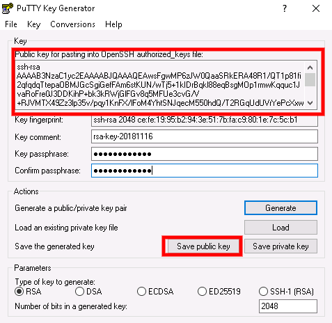

2.  Save the private key to the same location but with the filename **private**.

     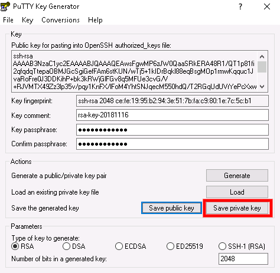
 
1.  Highlight and copy the public key from the top window.

     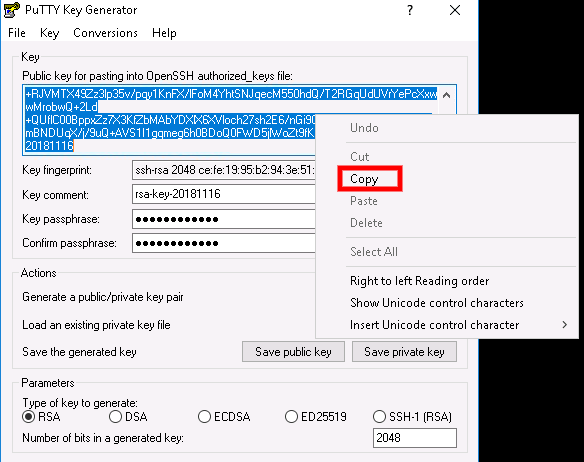

### Task 2: Create a Linux virtual machine in the Azure portal

1.  Navigate back to the **Azure Portal**.

1.  Choose **Create a resource** in the upper left corner of the Azure portal.

1.  In the search box above the list of Azure Marketplace resources, search for and select **Ubuntu Server 18.04 LTS** by Canonical, then choose **Create**.

1.  In the **Basics** tab, under **Project details**, make sure the correct subscription is selected and then choose the **Resource group** *myResourceGroup*. 

     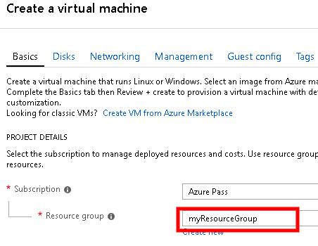

1.  Under **Instance details**, type *myVM-Linux* for the **Virtual machine name** and choose *East US* for your **Region**. Leave the other defaults.
 
     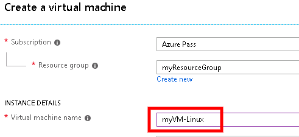

1.  Under **Administrator account**, select **SSH public key**, type the user name **localadmin**, then paste your public key into the text box. Remove any leading or trailing white space in your public key.

       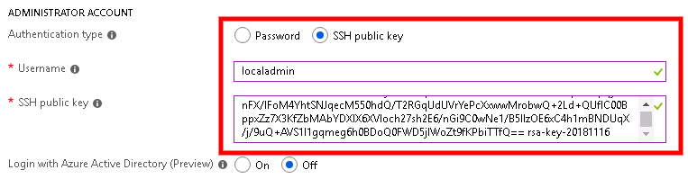

1.  Under **Inbound port rules** > **Public inbound ports**, choose **Allow selected ports** and then select **SSH (22)** and **HTTP (80)** from the drop-down. 

    

1.  Click the **Management** tab and select **No** or **Off** for all options.

     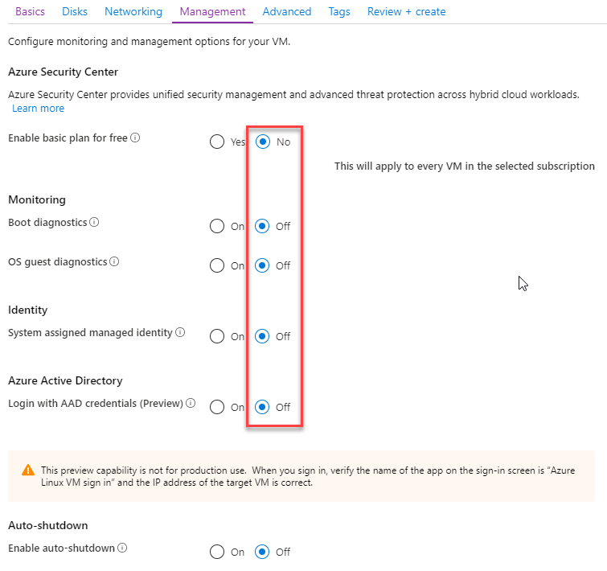

1.  Leave the remaining defaults and then select the **Review + create** button at the bottom of the page.

1.  On the **Create a virtual machine** page, you can see the details about the VM you are about to create. When you are ready, select **Create**.

     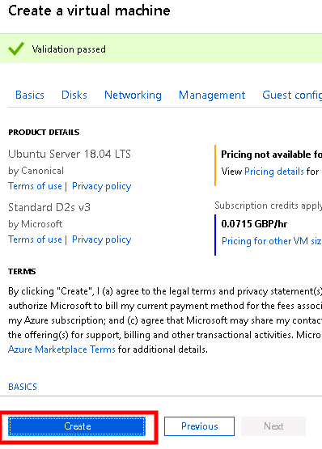
 

It will take a few minutes for your VM to be deployed. When the deployment is finished, move on to the next section. 


### Task 3: Connect to your VM


One way to make an SSH connection to your Linux VM from Windows is to use an SSH client. This is the preferred method if you have an SSH client installed on your Windows system, or if you use the SSH tools in Bash in Azure Cloud Shell. If you prefer a GUI-based tool, you can connect with PuTTY.  In this task you will use PuTTY.


1.  In the **Azure Portal Hub Menu** click **Virtual Machines** then select your **myVM-Linux** machine.


1.  In the Overview blade, note down or copy the **Public IP Address** of your virtual machine *If this does not display, refresh your browser*.

    **Note:** Your public IP will be different to what is shown in the screenshot.


     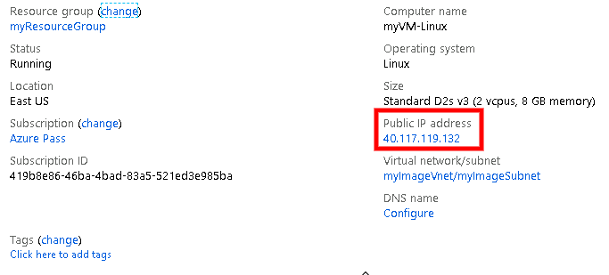

1.  Start **PuTTy** by clicking the start menu and searching for PuTTY.

     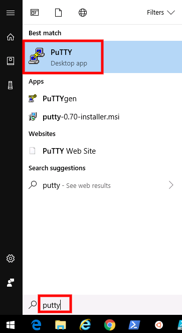

2.  Type in or paste in your Public IP Address of your Linux Azure Linux VM:

       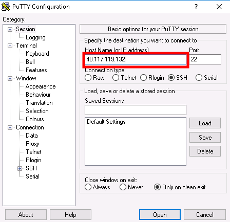

3.  Select the **Connection** > **SSH** > **Auth** category. Browse to and select your PuTTY private key (.ppk file):

     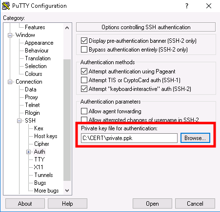

4.  Click **Open** to connect to your VM.

5.  Click **Yes** to continue on the pop up.

1.  On the `login as` screen enter **localadmin** and press **Enter** then enter the password Pa55w.rd1234 and press **Enter**. ***Note**: As you type the password the curser will not move*

     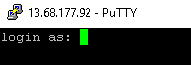
 
2.  You are now logged into the Linux VM hosted in Azure.

     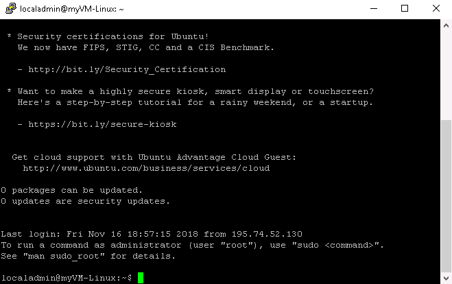

| WARNING: Prior to continuing you should remove all resources used for this lab.  To do this in the **Azure Portal** click **Resource groups**.  Select any resources groups you have created.  On the resource group blade click **Delete Resource group**, enter the Resource Group Name and click **Delete**.  Repeat the process for any additional Resource Groups you may have created. **Failure to do this may cause issues with other labs.** |
| --- |

**Results**: You have now completed this Lab.
