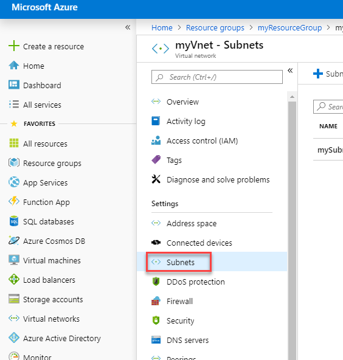
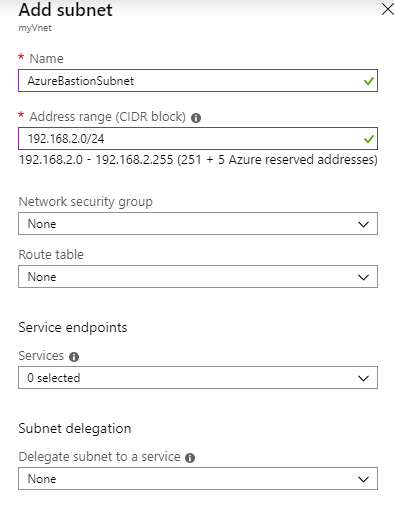
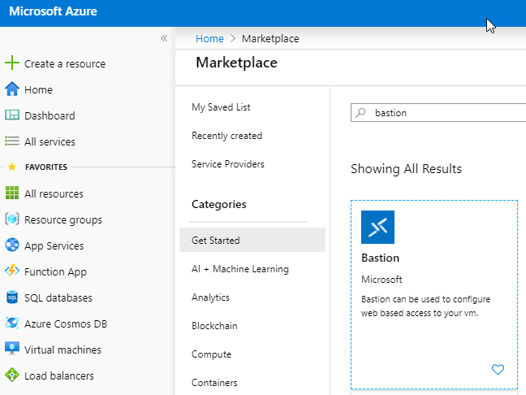
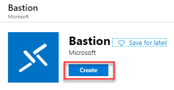
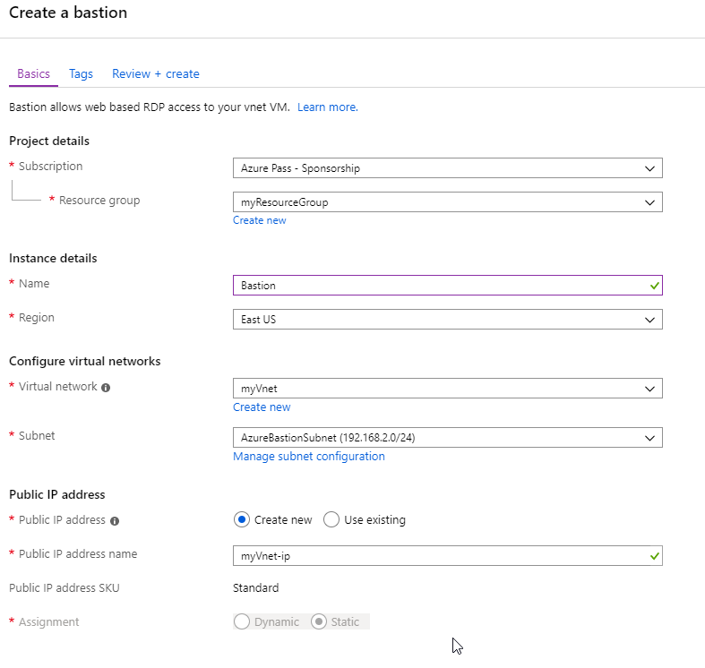
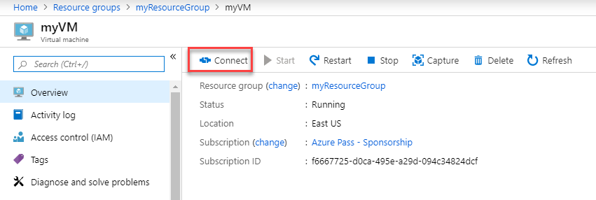
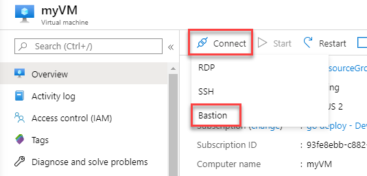
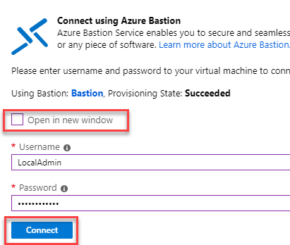
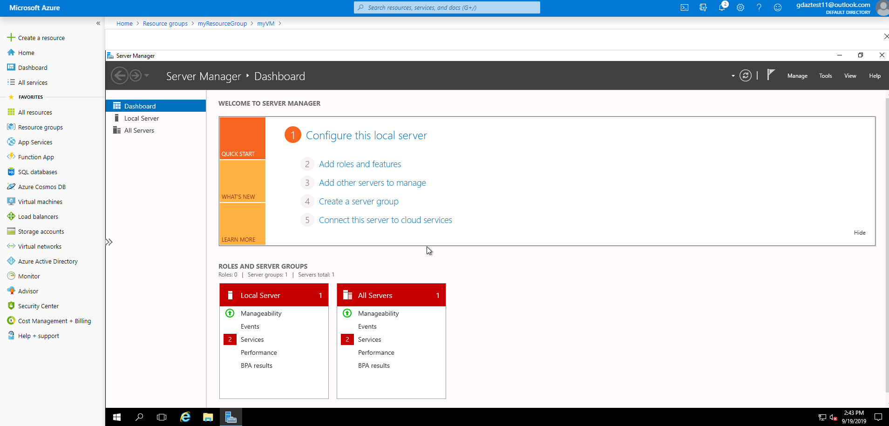

# Module 2: Lab 14 - Azure Bastion


**Scenario**

The Azure Bastion service is a new fully platform-managed PaaS service that you provision inside your virtual network. It provides secure and seamless RDP/SSH connectivity to your virtual machines directly in the Azure portal over SSL. When you connect via Azure Bastion, your virtual machines do not need a public IP address.

Bastion provides secure RDP and SSH connectivity to all VMs in the virtual network in which it is provisioned. Using Azure Bastion protects your virtual machines from exposing RDP/SSH ports to outside world while still providing secure access using RDP/SSH. With Azure Bastion, you connect to the virtual machine directly from the Azure portal. You don't need an additional client, agent, or piece of software.


## Exercise 1: Implement Azure Bastion

### Task 1: Enable Azure Bastion on your subscription

1.  Open a browser and navigate to `https://portal.azure.com`

1.  Open the **Cloud Shell** in PowerShell mode and create storage if required.

1.  Run the following 2 commands to create a Resource Group and Virtual Machine and VNet to test the Azure Bastion service.

    ```powershell
    New-AzResourceGroup -Name myResourceGroup -Location "East US"
    ```
    
    ```powershell
    New-AzVm -ResourceGroupName "myResourceGroup" -Name "myVM" -Location "East  US" -VirtualNetworkName "myVnet" -SubnetName "mySubnet" -SecurityGroupName   "myNetworkSecurityGroup"
    ```

    **Note**: The VM is being created without a Public IP Address.


1.  When prompted enter **LocalAdmin** and **Pa55w.rd1234** for the credentials.

1.  In the Azure Portal navigate to your **myVnet** and click **Subnets**.

     
 
1.  Click **+ Subnet** and create a subnet with the following details:

      - Name: **AzureBastionSubnet** _(Note this is case sensitive)_
      - Address Range: **192.168.2.0/24**

1.  Click **OK**.

     

### Task 2: Create a bastion host

1.  From the home page in the **Azure portal** click **+ Create a resource**. 

1.  On the **New** page, in the *Search the Marketplace* field, type **Bastion**, then click **Enter** to get to the search results.

1.  From the results, click **Bastion**. 

     

1.  On the **Bastion** page, click **Create** to open the **Create a bastion** page.

     

1.  On the **Create a bastion** page, configure a new Bastion resource. Specify the configuration settings below.

    * **Subscription**: Select your Subscription
    * **Resource Group**: myResourceGroup
    * **Name**: Bastion
    * **Region**: East US
    * **Virtual network**: **myVnet**
    * **Subnet**: **AzureBastionSubnet**
    * **Public IP address**: The public IP of the Bastion resource on which RDP/SSH will be accessed (over port 443). Create a new public IP, or use an existing one. The public IP address must be in the same region as the Bastion resource you are creating.
    * **Public IP address name**: Leave as default
    * **Public IP address SKU**: Prepopulated by default to **Standard**. Azure Bastion uses/supports only the Standard Public IP SKU.
    * **Assignment**: Prepopulated by default to **Static**.
</br>

1.  When you have finished specifying the settings, click **Review + Create**. This validates the values. Once validation passes, you can begin the creation process.

     

1.  On the Create a bastion page, click **Create**.
1.  You will see a message letting you know that your deployment is underway. Status will display on this page as the resources are created. It takes about 5 mins for the Bastion resource to be created and deployed.

### Task 3: Connect to a VM using a bastion host 


If you create a bastion host in the portal by using an existing VM, various settings will automatically default corresponding to your virtual machine and/or virtual network.


1.  In the **Azure portal**, navigate to your virtual machine, then click **Connect**.

       

1.  On the dropdown, click **Bastion**.

       

1.  De-select Open in new window and then enter **LocalAdmin** and **Pa55w.rd1234** for the credentials and click **Connect**.

     

1.  You should now be connected to your VM.

     
 

| WARNING: Prior to continuing you should remove all resources used for this lab.  To do this in the **Azure Portal** click **Resource groups**.  Select any resources groups you have created.  On the resource group blade click **Delete Resource group**, enter the Resource Group Name and click **Delete**.  Repeat the process for any additional Resource Groups you may have created. **Failure to do this may cause issues with other labs.** |
| --- |

**Results**: You have now completed this lab.

