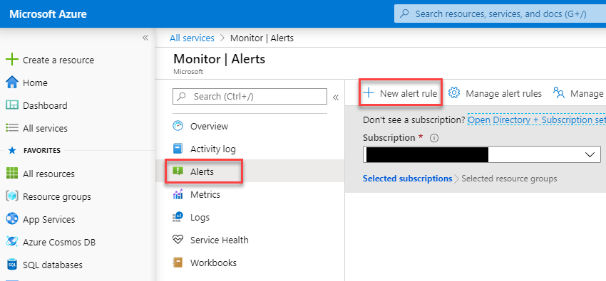
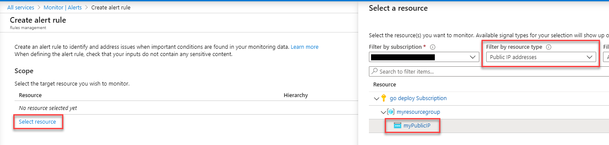
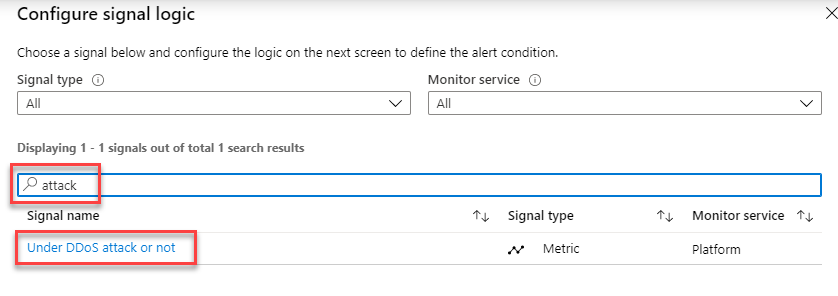
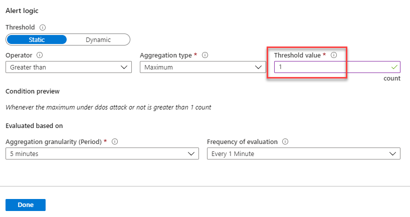
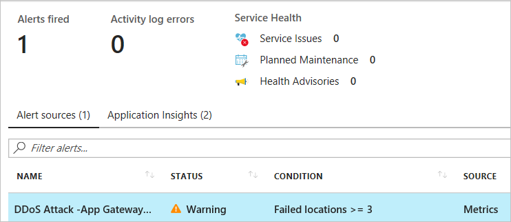
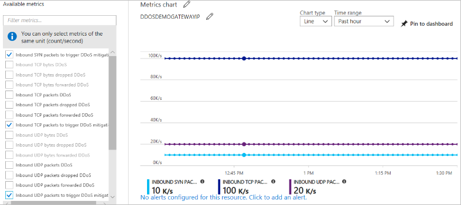

# Module 2: Lab 15 - Manage Azure DDoS Protection Standard

In this lab you will learn how to enable and disable distributed denial of service (DDoS) protection, and use telemetry to mitigate a DDoS attack with Azure DDoS Protection Standard. DDoS Protection Standard protects Azure resources such as virtual machines, load balancers, and application gateways that have an Azure public IP address assigned to it. 

## Exercise 1: Implement DDoS protection in Azure.

### Task 1: Create a DDoS protection plan

A DDoS protection plan defines a set of virtual networks that have DDoS protection standard enabled, across subscriptions. You can configure one DDoS protection plan for your organization and link virtual networks from multiple subscriptions to the same plan. The DDoS Protection Plan itself is also associated with a subscription, that you select during the creation of the plan. The DDoS Protection Plan works across regions and subscriptions. Example -you can create the plan in Region East-US and link to subscription #1 in your tenant. The same plan can be linked to virtual networks from other subscriptions in different regions, across your tenant. The subscription the plan is associated to incurs the monthly recurring bill for the plan, as well as overage charges, in case the number of protected public IP addresses exceed 100. 

Creation of more than one plan is not required for most organizations. A plan cannot be moved between subscriptions. If you want to change the subscription a plan is in, you have to delete the existing plan and create a new one.

1.  Select **Create a resource** in the upper left corner of the Azure portal.
2.  Search for *DDoS*. When **DDos protection plan** appears in the search results, select it.
3.  Select **Create**.
4.  Enter or select your own values, or enter, or select the following example values, and then select **Create**:

    |Setting        |Value                                              |
    |---------      |---------                                          |
    |Name           | myDdosProtectionPlan                              |
    |Subscription   | Select your subscription.                         |
    |Resource group | Select **Create new** and enter *myResourceGroup* |
    |Location       | East US                                           |

### Task 2: Enable DDoS for a new virtual network

1.  Select **Create a resource** in the upper left corner of the Azure portal.
2.  Select **Networking**, and then select **Virtual network**.
3.  Enter or select your own values, of enter or select the following example values, accept the remaining defaults, and then select **Review + create**, then click **Create**:

    | Setting         | Value                                                        |
    | ---------       | ---------                                                    |
    | Name            | myVirtualNetwork                                             |
    | Subscription    | Select your subscription.                                    |
    | Resource group  | Select **Use existing**, and then select **myResourceGroup** |
    | Location        | East US                                                      |
    | DDos protection | Select the **Security Tab**.  Select **Standard** and then under **DDoS protection**, select **myDdosProtectionPlan**. The plan you select can be in the same, or different subscription than the virtual network, but both subscriptions must be associated to the same Azure Active Directory tenant.|

    You cannot move a virtual network to another resource group or subscription when DDoS Standard is enabled for the virtual network. If you need to move a virtual network with DDoS Standard enabled, disable DDoS Standard first, move the virtual network, and then enable DDoS standard. After the move, the auto-tuned policy thresholds for all the protected public IP addresses in the virtual network are reset.

1.  Click **All Services** and search for and select **Public IP addresses**.

1.  Click **+ Add** and create an **IPv4** Public IP address in your **myResourceGroup** Resource Group.

### Task 3: Disable DDoS for a virtual network

1.  Enter the name of the virtual network you want to disable DDoS protection standard for in the **Search resources, services, and docs box** at the top of the portal. When the name of the virtual network appears in the search results, select it.

2.  Select **DDoS protection**, under **SETTINGS**.
3.  Select **Basic** under **DDoS protection plan** and then select **Save**.

### Task 4: Work with DDoS protection plans

1.  Select **All services** on the top, left of the portal.

2.  Enter *DDoS* in the **Filter** box. When **DDoS protection plans** appear in the results, select it.
3.  Select the protection plan you want to view from the list.
4.  All virtual networks associated to the plan are listed.
5.  If you want to delete a plan, you must first dissociate all virtual networks from it. 

### Task 5: Configure alerts for DDoS protection metrics

You can select any of the available DDoS protection metrics to alert you when there's an active mitigation during an attack, using the Azure Monitor alert configuration. When the conditions are met, the address specified receives an alert email:

1.  Select **All services** on the top, left of the portal.
2.  Enter *Monitor* in the **Filter** box. When **Monitor** appears in the results, select it.
3.  Select **Alerts**.
1.  On the **Monitor** blade click **Alerts** then click **+ New alert rule**.

    

1.  Click **Select resource**.

1.  Select your Subscription and then in the Filter by resource type drop down, select **Public IP addresses** then select **myPublicIP** (or the name of your public ip address you created earlier) then click **Done**.

    

1.  Click **Select condition**.

1.  Search for ***attack*** and select **Under DDos attack or not**.

    

1.  Scroll down the **Configure signal logic** blade and in the **Threashold value** enter **1** - **1** means you are under attack. **0** means you are not under attack.  Click **Done**.

    

1.  On the **Create alert rule** blade, click **Select action group** then click **+ Create action group.** and enter the following details.

    |Setting                  |Value                                                                                               |
    |---------                |---------                                                                                           |
    |Action group name                     | **DDOS AG**  |
    |Short Name| **ddosag**        |
    |Subscription| Select your subscription        |
    |Resource Group| Select **myResourceGroup**        |
    |Action Name| DDOS Alert Email        |
    |Action Type| Select **Email/SMS message/Push/Voice** then select email and enter a valid email address and click **OK**.|

1.  Back on the Add action group blade click **OK**.

1.  Give the Alert a name and click **Create alert rule**.

    Within a few minutes of an attack detection, you would receive an email from Azure Monitor metrics that looks similar to the following screenshot:

       

### Task 6: Use DDoS protection telemetry

Telemetry for an attack is provided through Azure Monitor in real time. The telemetry is available only for the duration that a public IP address is under mitigation. You don't see telemetry before or after an attack is mitigated.

1.  Select **All services** on the top, left of the portal.

2.  Enter *Monitor* in the **Filter** box. When **Monitor** appears in the results, select it.
3.  Select **Metrics**.
4.  Select the **Subscription** and **Resource group** that contain the public IP address that you want telemetry for  then click **Apply**.
6.  A series of **Available Metrics** appear on the top of the screen. These metrics, when selected, are graphed in the **Azure Monitor Metrics Chart** on the overview screen.
7.  Select the Public IP Address you created earlier and select the **Under DDoS attack or not** Metric and under **aggregation** select **Max**

 The metric names present different packet types, and bytes vs. packets, with a basic construct of tag names on each metric as follows:

  - **Dropped tag name** (for example, **Inbound Packets Dropped DDoS**): The number of packets dropped/scrubbed by the DDoS protection system.
  - **Forwarded tag name** (for example **Inbound Packets Forwarded DDoS**): The number of packets forwarded by the DDoS system to the destination VIP - traffic that was not filtered.
  - **No tag name** (for example **Inbound Packets DDoS**): The total number of packets that came into the scrubbing system - representing the sum of the packets dropped and forwarded.

### Task 7: View DDoS mitigation policies

DDoS Protection Standard applies three auto-tuned mitigation policies (TCP SYN, TCP & UDP) for each public IP address of the protected resource, in the virtual network that has DDoS enabled. You can view the policy thresholds by selecting the  **Inbound TCP packets to trigger DDoS mitigation** and **Inbound UDP packets to trigger DDoS mitigation** metrics with **aggregation** type as 'Max', as shown in the following picture:

   

Policy thresholds are auto-configured via Azure machine learning-based network traffic profiling. Only when the policy threshold is breached does DDoS mitigation occur for the IP address under attack.

### Task 8: Configure DDoS attack mitigation reports

Attack mitigation reports uses the Netflow protocol data which is aggregated to provide detailed information about the attack on your resource. Anytime a public IP resource is under attack, the report generation will start as soon as the mitigation starts. There will be an incremental report generated every 5 mins and a post-mitigation report for the whole mitigation period. This is to ensure that in an event the DDoS attack continues for a longer duration of time, you will be able to view the most current snapshot of mitigation report every 5 minutes and a complete summary once the attack mitigation is over. 

1.  Select **All services** on the top, left of the portal.

2.  Enter *Monitor* in the **Filter** box. When **Monitor** appears in the results, select it.
3.  Under **SETTINGS**, select **Diagnostic Settings**.
4.  Select the **Subscription** and **Resource group** that contain the public IP address you want to log.
5.  Select **Public IP Address** for **Resource type**, then select the specific public IP address you want to log metrics for.
6.  Select **+ Add diagnostic setting** to collect the DDoSMitigationReports log and give the Diagnostic setting the name **DDoSLog** and then select as many of the following options as you require then click **Save**:

    - **Archive to a storage account**: Data is written to an Azure Storage account. 
    - **Stream to an event hub**: Allows a log receiver to pick up logs using an Azure Event Hub. Event hubs enable integration with Splunk or other SIEM systems. 
    - **Send to Log Analytics**: Writes logs to the Azure Monitor service. 
 

 Both the incremental & post-attack mitigation reports include the following fields
 
  - Attack vectors
  - Traffic statistics
  - Reason for dropped packets
  - Protocols involved
  - Top 10 source countries or regions
  - Top 10 source ASNs

### Task 9: Configure DDoS attack mitigation flow logs

Attack Mitigation Flow Logs allow you to review the dropped traffic, forwarded traffic and other interesting datapoints during an active DDoS attack in near-real time. You can ingest the constant stream of this data into your SIEM systems via event hub for near-real time monitoring, take potential actions and address the need of your defense operations. 

1.  Select **All services** on the top, left of the portal.

2.  Enter *Monitor* in the **Filter** box. When **Monitor** appears in the results, select it.
3.  Under **SETTINGS**, select **Diagnostic Settings**.
4.  Select the **Subscription** and **Resource group** that contain the public IP address you want to log.
5.  Select **Public IP Address** for **Resource type**, then select the specific public IP address you want to log metrics for.
6.  Select **Turn on diagnostics to collect the DDoSMitigationFlowLogs log** and then select as many of the following options as you require:

    - **Archive to a storage account**: Data is written to an Azure Storage account. To learn more about this option.
    - **Stream to an event hub**: Allows a log receiver to pick up logs using an Azure Event Hub. Event hubs enable integration with Splunk or other SIEM systems. 
    - **Send to Log Analytics**: Writes logs to the Azure Monitor service. 
1.  To view the flow logs data in Azure analytics dashboard.

 Flow logs will have the following fields: 

  - Source IP
  - Destination IP
  - Source Port 
  - Destination port 
  - Protocol type 
  - Action taken during mitigation

### Task 10: Validate DDoS detection (Optional and not part of the AZ-500 course)

**Note**: Only carry out this task if you feel comfortable to do so.  This task does not form part of the course and is a stretch exercise for those students who wish to do so.

Microsoft has partnered with [BreakingPoint Cloud](https://www.ixiacom.com/products/breakingpoint-cloud) to build an interface where you can generate traffic against DDoS Protection-enabled public IP addresses for simulations. The BreakPoint Cloud simulation allows you to:

- Validate how Microsoft Azure DDoS Protection protects your Azure resources from DDoS attacks
- Optimize your incident response process while under DDoS attack
- Document DDoS compliance
- Train your network security teams

**Permissions**

To work with DDoS protection plans, your account must be assigned to the network contributor role or to a role that is assigned the appropriate actions listed in the following table:

| Action                                            | Name                                     |
| ---------                                         | -------------                            |
| Microsoft.Network/ddosProtectionPlans/read        | Read a DDoS protection plan              |
| Microsoft.Network/ddosProtectionPlans/write       | Create or update a DDoS protection plan  |
| Microsoft.Network/ddosProtectionPlans/delete      | Delete a DDoS protection plan            |
| Microsoft.Network/ddosProtectionPlans/join/action | Join a DDoS protection plan              |

To enable DDoS protection for a virtual network, your account must also be assigned the appropriate actions for virtual networks.

| WARNING: Prior to continuing you should remove all resources used for this lab.  To do this in the **Azure Portal** click **Resource groups**.  Select any resources groups you have created.  On the resource group blade click **Delete Resource group**, enter the Resource Group Name and click **Delete**.  Repeat the process for any additional Resource Groups you may have created. **Failure to do this may cause issues with other labs.** |
| --- |

**Results**: You have now completed this lab.
