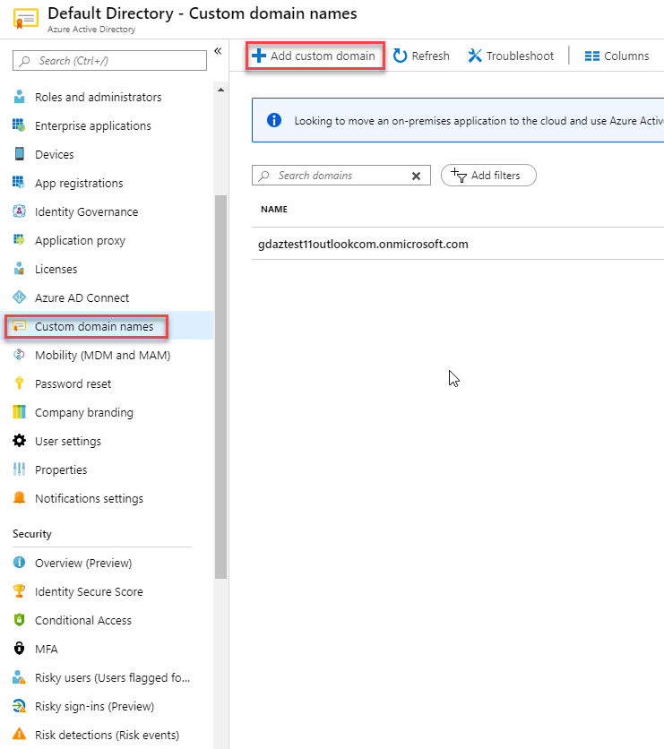
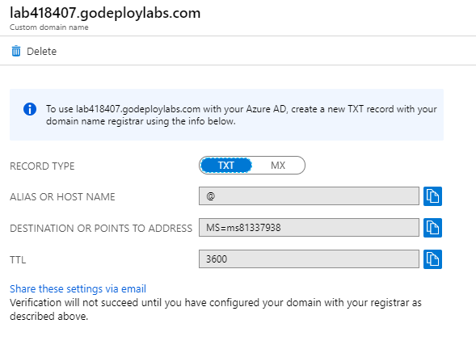
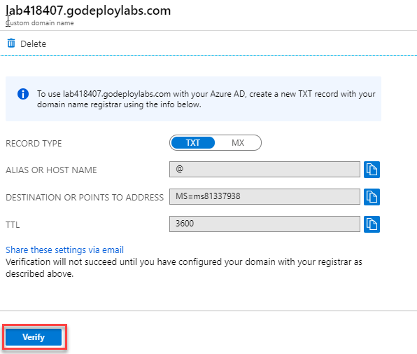
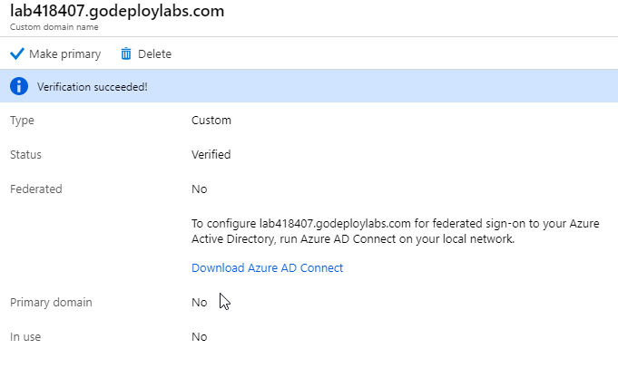

# Module 2: Lab 18 -  Custom Domains

**Scenario**

Every new Azure AD tenant comes with an initial domain name, domainname.onmicrosoft.com. You can't change or delete the initial domain name, but you can add your organization's names to the list. Adding custom domain names helps you to create user names that are familiar to your users, such as alain@contoso.com.

### Exercise 1: Add your custom domain name using the Azure Active Directory portal

### Task 1: Add your custom domain name to Azure AD

1.  In the Azure Portal, select **Azure Active Directory**.

1.  Select **Custom domain names**, and then select **Add custom domain**.

       

2.  Navigate to the DNS tab in the Lab Environment to identify the unique custom domain name you have been allocated.  This will be in the form of labxxxxxx.customdomainname.com.

1.  In the Custom Domain name field type in your domain name you identified in the previous step and click **Add domain**.

    The unverified domain is added and the **labxxxxx.customdomainname.com** page appears showing you your DNS info.

4.  Copy the DNS info from the **labxxxxx.customdomainname.com** page. For example, MS=ms64983159.

       

### Task 2: Add your DNS information to the domain registrar

After you add your custom domain name to Azure AD, you must return to your domain registrar and add the Azure AD DNS information from your copied TXT file. Creating this TXT record for your domain "verifies" ownership of your domain name.

1.  Go back to the DNS tab in the Lab environment and  create a new TXT record for your domain based on your copied DNS information.  You only need to enter the value record.  Leave the name field blank and click **Save**.

**Note**: You can register as many domain names as you want. However, each domain gets its own TXT record from Azure AD. Be careful when entering your TXT file information at the domain registrar. If you enter the wrong, or duplicate information by mistake, you'll have to wait until the TTL times out (60 minutes) before you can try again.

### Task 2: Verify your custom domain name

After you register your custom domain name, you need to make sure it's valid in Azure AD. The propagation from your domain registrar to Azure AD can be instantaneous or it can take up to a few days, depending on your domain registrar.

1.  Return back to the Azure Portal **labxxxxx.customdomainname.com** page and click **Verify**.

     

1.  Your domain should now be verified.

     

1.  After you've verified your custom domain name, you can delete your verification TXT record.

**Results**: You have now completed this lab.

