# Module 4: Lab 2 -Security Center

Azure Security Center is a unified infrastructure security management system that strengthens the security posture of your data centers, and provides advanced threat protection across your hybrid workloads in the cloud - whether they're in Azure or not - as well as on premises.

Keeping your resources safe is a joint effort between your cloud provider, Azure, and you, the customer. You have to make sure your workloads are secure as you move to the cloud, and at the same time, when you move to IaaS (infrastructure as a service) there is more customer responsibility than there was in PaaS (platform as a service), and SaaS (software as a service). Azure Security Center provides you the tools needed to harden your network, secure your services and make sure you're on top of your security posture.

## Exercise 1: Onboard your Azure subscription to Security Center Standard

Azure Security Center provides unified security management and threat protection across your hybrid cloud workloads. While the Free tier offers limited security for your Azure resources only, the Standard tier extends these capabilities to on-premises and other clouds. Security Center Standard helps you find and fix security vulnerabilities, apply access and application controls to block malicious activity, detect threats using analytics and intelligence, and respond quickly when under attack. You can try Security Center Standard at no cost. To learn more, see the pricing page.

In this Exercise, you upgrade to the Standard tier for added security and install the Microsoft Monitoring Agent on your virtual machines to monitor for security vulnerabilities and threats.

### Task 1: Automate data collection

Security Center collects data from your Azure VMs and non-Azure computers to monitor for security vulnerabilities and threats. Data is collected using the Microsoft Monitoring Agent, which reads various security-related configurations and event logs from the machine and copies the data to your workspace for analysis. By default, Security Center will create a new workspace for you.

When automatic provisioning is enabled, Security Center installs the Microsoft Monitoring Agent on all supported Azure VMs and any new ones that are created. Automatic provisioning is strongly recommended.

To enable automatic provisioning of the Microsoft Monitoring Agent:

1.  In the Azure Portal, select the **Security Center** from the Hub menu.

     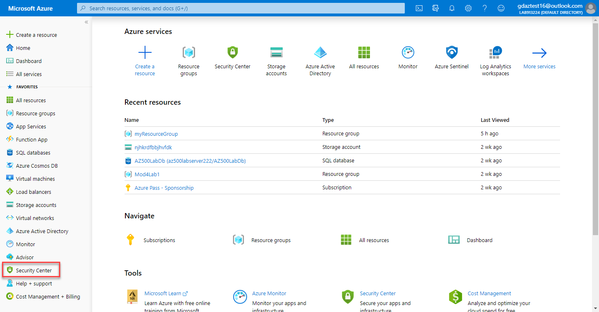

1.  On the **Getting started** blade click **Upgrade**.
     
1.  Under the Security Center main menu, select **Pricing & settings**.

2.  On the row of the subscription, click on the subscription on which you'd like to change the settings.
3.  In the **Data Collection** tab, set **Auto provisioning** to **On**.
4.  Exit the blade **without** saving.

    **Note**: Ensure you do not click save otherwise the following exercises will not function as expected.

 
     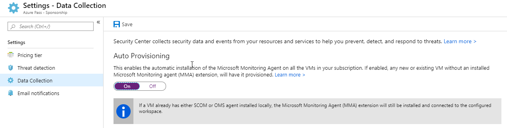

 With this new insight into your Azure VMs, Security Center can provide additional Recommendations related to system update status, OS security configurations, endpoint protection, as well as generate additional Security alerts.

## Exercise 2: Onboard Windows computers to Azure Security Center

After you onboard your Azure subscriptions, you can enable Security Center for resources running outside of Azure, for example on-premises or in other clouds, by provisioning the Microsoft Monitoring Agent.

This exercise shows you how to install the Microsoft Monitoring Agent on a Windows computer.

### Task 1: Add new Windows computer

1.  In the Azure Portal, select **Security Center**. **Security Center - Overview** opens.

       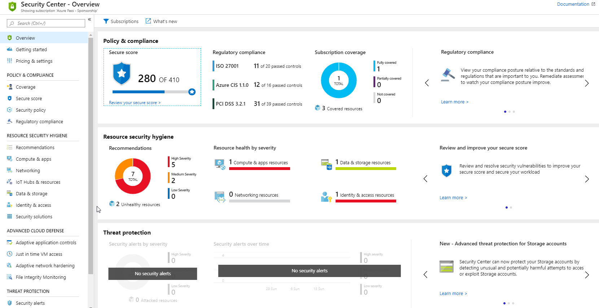

3.  Under the Security Center main menu, select **Getting started**.
4.  Select the **Install Agents** tab.

       

5.  Scroll down to the Install agents automatically section and click **Install agents**.

     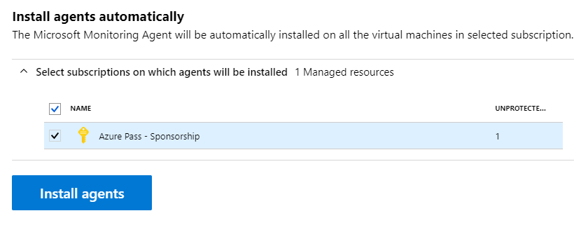

1.  Wait until the agent is install by monitoring the deployment.

     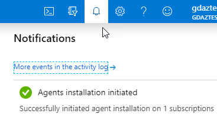
 
1.  Open the **Security Center** and click on **Compute & apps** then click on **VMs and Servers**.

     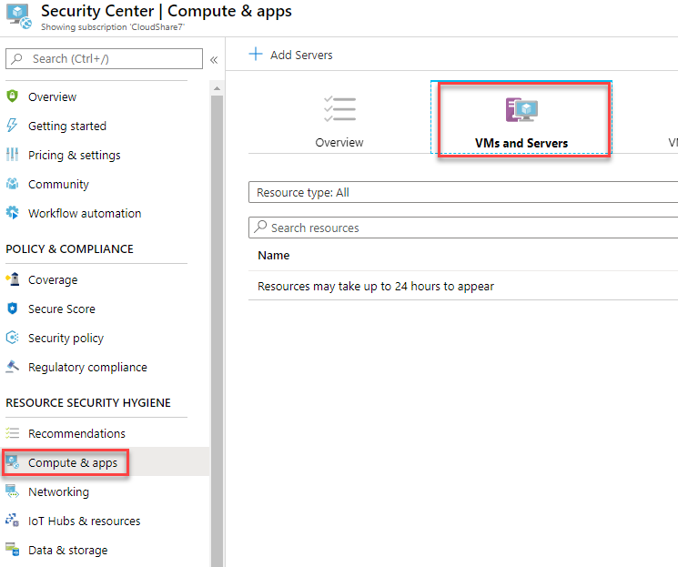
 
1.  Notice your Virtual Machine is now monitored.

## Exercise 3: Manage and respond to alerts in Azure Security Center

Security Center automatically collects, analyzes, and integrates log data from your Azure resources, the network, and connected partner solutions, like firewall and endpoint protection solutions, to detect real threats and reduce false positives. A list of prioritized security alerts is shown in Security Center along with the information you need to quickly investigate the problem and recommendations for how to remediate an attack.

### Task 1: Manage your alerts
 
1.  From the Security Center dashboard, see the  **Threat protection** tile to view and overview of the alerts.

    **Note**: If the tile displays **No security alerts**, you may have to wait some time for the evaluation to run.

       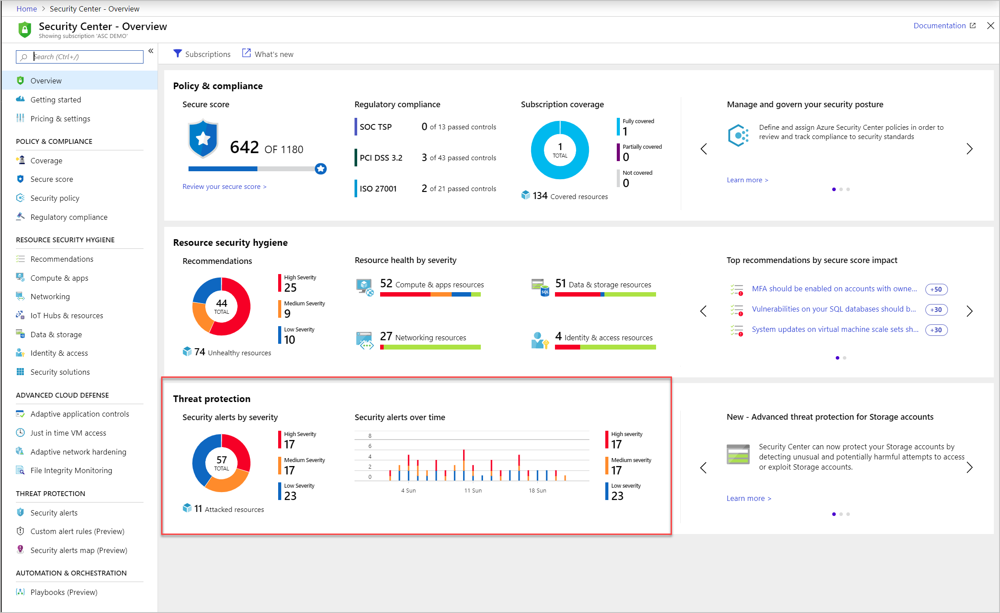

1.  To see more details about the alerts, click the tile.  The screenshot belown shows potential alerts you would see in the real world:

       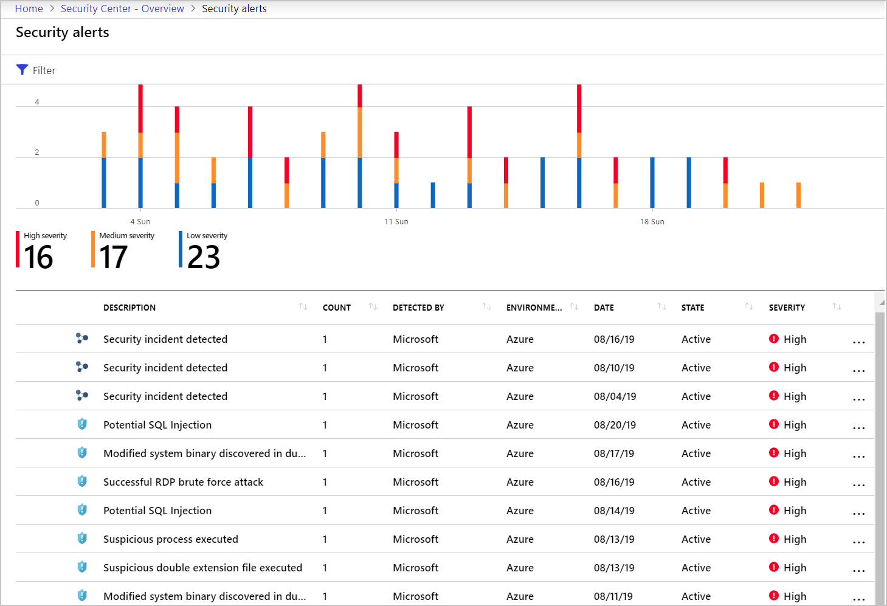

1.  To filter the alerts shown, click **Filter**, and from the **Filter** blade that opens, select the filter options that you want to apply. The list updates according to the selected filter. Filtering can be very helpful. For example, you might you want to address security alerts that occurred in the last 24 hours because you are investigating a potential breach in the system.

       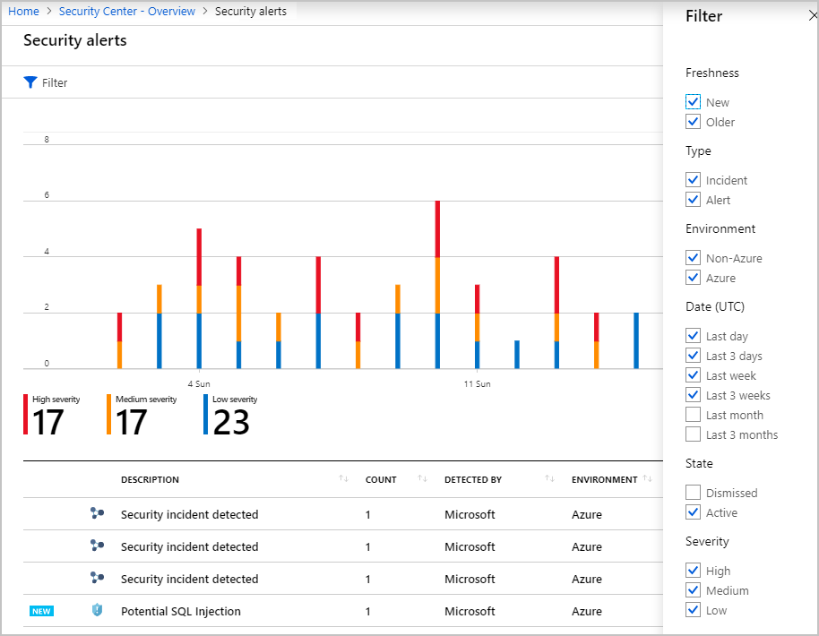

### Task 2: Respond to recommendations

1.  In the Azure Security Center click **Overview**.

1.  From the **Resource secuity hygiene** list, in the **Resource health by severity** section select **Compute & apps resources**

     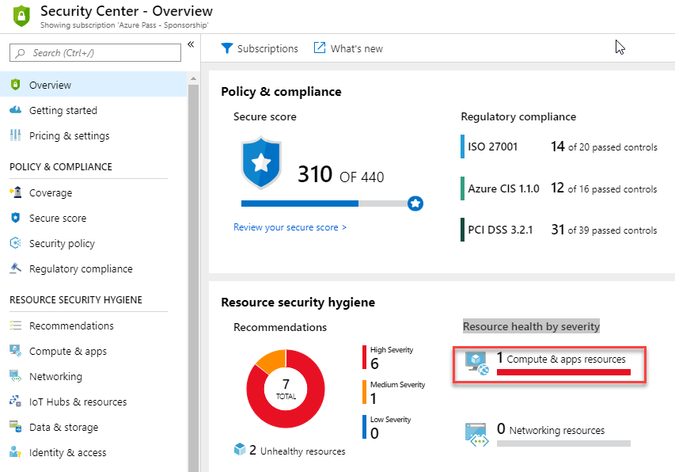

1.  Review the recommendations.

       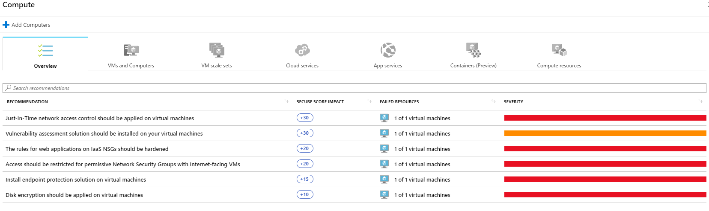

| WARNING: Prior to continuing you should remove all resources used for this lab.  To do this in the **Azure Portal** click **Resource groups**.  Select any resources groups you have created.  On the resource group blade click **Delete Resource group**, enter the Resource Group Name and click **Delete**.  Repeat the process for any additional Resource Groups you may have created. **Failure to do this may cause issues with other labs.** |
| --- |

**Results**: You have now completed this lab and can move onto the next lab in the series

