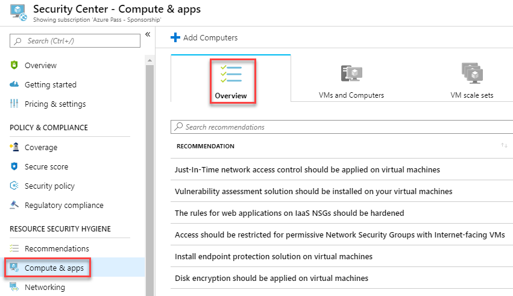
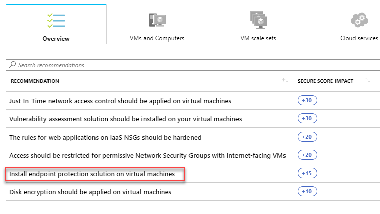
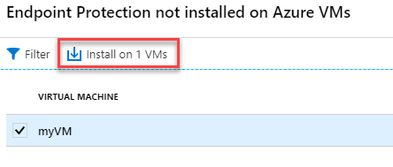

# Module 4: Lab 5 - Manage endpoint protection issues with Azure Security Center

Azure Security Center monitors the status of antimalware protection and reports this under the Endpoint protection issues blade. Security Center highlights issues, such as detected threats and insufficient protection, which can make your virtual machines (VMs) and computers vulnerable to antimalware threats. By using the information under **Endpoint protection issues**, you can identify a plan to address any issues identified.

Security Center reports the following endpoint protection issues:

- Endpoint protection not installed on Azure VMs - A supported antimalware solution is not installed on these Azure VMs.
- Endpoint protection not installed on non-Azure computers - A supported antimalware is not installed on these non-Azure computers.
- Endpoint protection health:

  - Signature out of date - An antimalware solution is installed on these VMs and computers, but the solution does not have the latest antimalware signatures.
  - No real time protection - An antimalware solution is installed on these VMs and computers, but it is not configured for real-time protection. 
  - Not reporting - An antimalware solution is installed but not reporting data.
  - Unknown -  An antimalware solution is installed but its status is unknown or reporting an unknown error.

## Exercise 1: Implement the recommendation

Endpoint protection issues is presented as a recommendation in Security Center.  If your environment is vulnerable to antimalware threats, this recommendation will be displayed under **Recommendations** and under **Compute**. To see the **Endpoint protection issues dashboard**, you need to follow the Compute workflow.

In this exercise, we will use **Compute**.  We will look at how to install antimalware on Azure VMs and on non-Azure computers.

### Task 1: Install antimalware on Azure VMs

1.  Select **Compute & apps** under the Security Center main menu or **Overview**.

       

2.  Under **Compute**, select **Install endpoint protection solution on virtual machines**. The **Endpoint protection issues** dashboard opens.

       

1.  On the **Endpoint Protection not installed on Azure VMs** blade click **Install on 1 VMs**.

     

5.  Under **Select Endpoint protection**, select the endpoint protection solution you want to use. In this example, select **Microsoft Antimalware**.

6.  Additional information about the endpoint protection solution is displayed. Select **OK**.

**Results**: You have now completed this lab.
