# Module 4: Lab 8 - Create security baselines 

Azure doesn't monitor security or respond to security incidents within the customer's area of responsibility. Azure does provide many tools (such as Azure Security Center, Azure Sentinel) that are used for this purpose. There is also an effort to help make every service as secure as possible by default. That is, every service comes with a baseline that is already designed to help provide security for most common-use cases. However, because Azure cannot predict how a service will be used, you should always review these security controls to evaluate whether they adequately mitigate risks.

This lab will guide you through a security baseline for Azure services. Each unit will provide a checklist of things to verify about the services you are using in your architecture.

In this lab, you will:

- Learn Azure platform security baselines and how they were created
- Create and validate a security baseline for the most commonly used Azure services

 
## Exercise 1: Create an Identity & Access Management (IAM) baseline

Identity management is key to granting access and to the security enhancement of corporate assets. To secure and control your cloud-based assets you must manage identity and access for your Azure administrators, application developers, and application users.

**IAM recommendations**

Here are the recommendations for identity and access management. Included with each recommendation are the basic steps to follow in the Azure portal. 

### Task 1: Restrict access to the Azure AD administration portal

All non-Administrators should not have access due to the sensitive data and the rules of least privilege.

1.  Sign in to the Azure portal.

2.  On the left, select **Azure Active Directory** > **Users**.

3.  Go to **User settings**.

4.  Ensure that Restrict access to Azure AD administration portal is set to Yes. Setting this value to Yes restricts all non-administrators from accessing any Azure AD data in the administration portal, but does not restrict such access using PowerShell or another client such as Visual Studio.

       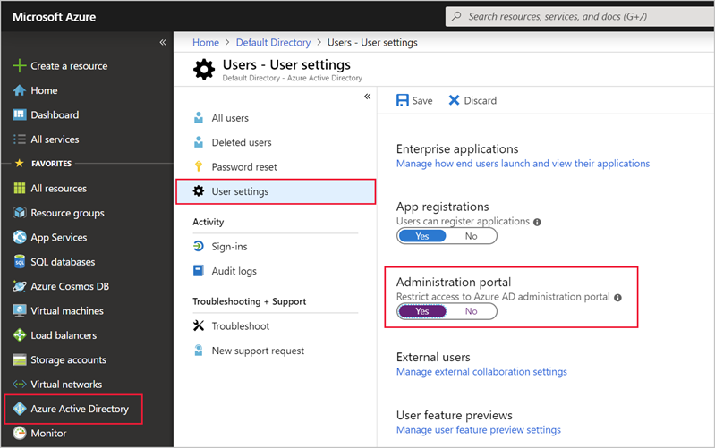

1.  Click **Save**.

### Task 2: Enable Azure Multi-Factor Authentication (MFA)

Enable it for privileged and non-privileged users.

1.  Sign in to the Azure portal.

2.  On the left, select **Azure Active Directory** > **Users**.

3.  Click **+ New User**.

1.  On the New user blade, enter the following details and click Create:

      - **Username**: Abbi
      - **Name**: Abbi Skinner
      - **First name**: Abbi 
      - **Last Name**: Skinner
      - **Roles**: Select Global Admin

2.  On the left, select **Azure Active Directory** > **Users** > **All users**.

3.  Select Multi-Factor Authentication. This will open a new window.

4.  Select Abbi Skinner and click **Enable**

       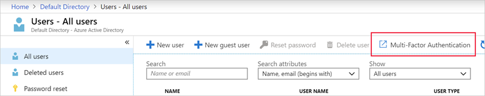

1.  Select **enable multi-factor auth** then click **Close**.

     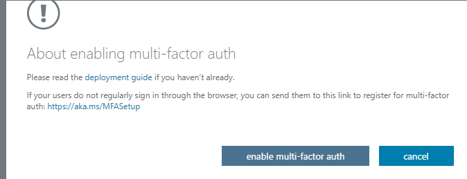
 
1.  Abbi is now enabled for MFA.

### Task 3: Block remembering MFA on trusted devices 

Remember Multi-Factor Authentication feature for devices and browsers that are trusted by the user is a free feature for all Multi-Factor Authentication users. Users can bypass subsequent verifications for a specified number of days, after they've successfully signed-in to a device by using Multi-Factor Authentication. If an account or device is compromised, remembering Multi-Factor Authentication for trusted devices can negatively affect security.

1.  Sign in to the Azure portal.

2.  On the left, select **Azure Active Directory** > **Users** > **All users**.

3.  Select Multi-Factor Authentication.

4.  Select **Abi Skinner**, then click **Manage users settings**.

5.  Ensure that **Restore multi-factor authentication on all remembered devices** is Selected then click **Save**.

       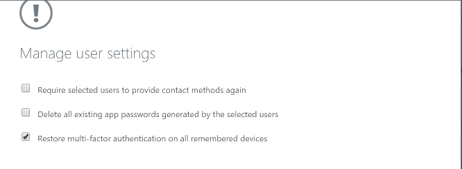

### Task 4: About guests 

In this task you will ensure that no guest users exist, or alternatively if the business requires guest users, ensure to limit their permissions.

1.  Sign in to the Azure portal.

2.  On the left, select **Azure Active Directory** > **Users** > **All users**.

3.  Select the Show drop down and select **Guest users only**.

4.  Verify that there are no guest users listed (`USER TYPE=Guest`).

       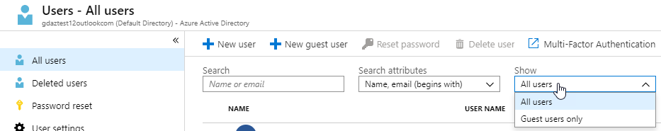

### Task 5: Password options

With dual identification set, an attacker would require compromising both the identity forms before they could maliciously reset a user's password.

1.  Sign in to the Azure portal.

2.  On the left, select **Azure Active Directory** > **Users**.

3.  Select **Password reset**.

4.  Go to Authentication methods.

5.  Set the Number of methods required to reset to 2.

1.  Select two methods and click **Save**.
    

### Task 6: Establish an interval for reconfirming user authentication methods 

If authentication reconfirmation is set to disabled, register users will never be prompted to re-confirm their authentication information.

1.  Sign in to the Azure portal.

2.  On the left, select **Azure Active Directory** > **Users**.

3.  Go to **Password reset**.

4.  Go to **Registration**.

5.  Ensure that Number of days before users are asked to re-confirm their authentication information is not set to 0. The default is 180 days.

       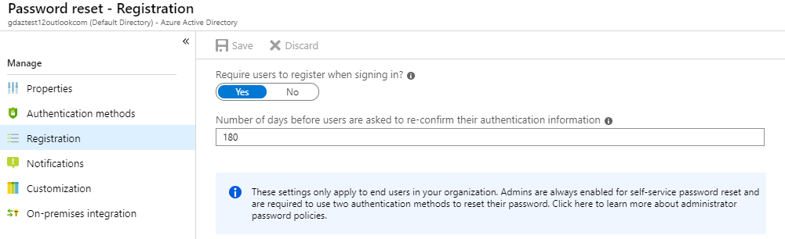

### Task 7: Disable Members invitations

Restricting invitations through administrators only ensures that only authorized accounts have access Azure resources.

1.  Sign in to the Azure portal.

2.  On the left, select **Azure Active Directory** > **Users**.

3.  Go to **User settings**.

4.  Go to External users, click **Manage external collaboration settings**.

5.  Ensure that Members can invite is set to **No**.

       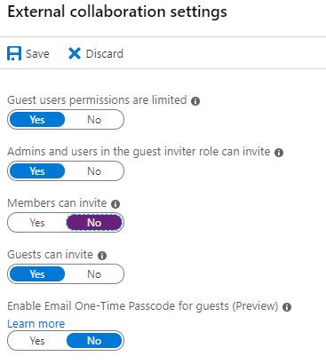

### Task 8: Users to create and manage security groups 

When this feature is enabled, all users in AAD are allowed to create new security groups. Security Group creation should be restricted to administrators.

1.  Sign in to the Azure portal.

2.  On the left, select **Azure Active Directory** > **Groups**.

3.  Go to **General** under the settings section.

4.  Ensure that Users can create security groups is set to **No**.

       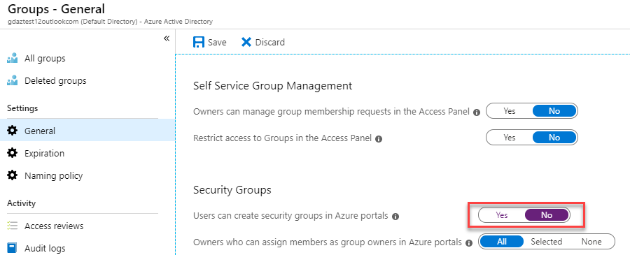

### Task 9: Self-service group management enabled 

Until your business requires this delegation to various users, it is a best practice to disable this feature.

1.  Sign in to the Azure portal.

2.  On the left, select **Azure Active Directory** > **Groups**

3.  Go to **General** under the settings section.

4.  Ensure that Self-service group management enabled is set to **No**.

       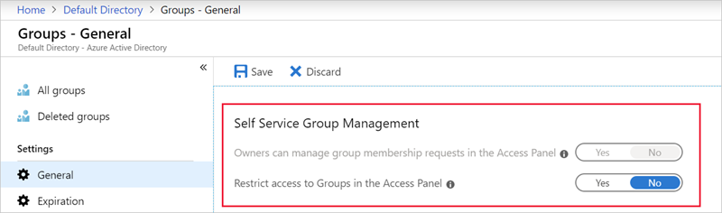

### Task 10: Application options - Allow users to register apps

Require administrators to register custom applications.

1.  Sign in to the Azure portal.

2.  On the left, select **Azure Active Directory** > **Users**

3.  Go to User settings.

4.  Ensure that User can register applications is set to **No** then click **Save**.

       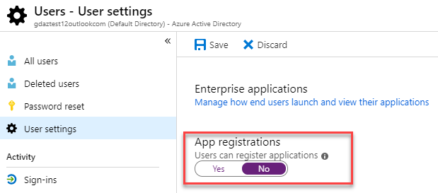

## Exercise 2: Create an Azure Security Center baseline

Azure Security Center (ASC) provides unified security management and advanced threat protection for workloads running in Azure, on-premises, and in other clouds. The following are Security Center recommendations that, if followed, will set various security policies on an Azure subscription.

These policies define the set of controls that are recommended for your resources with an Azure subscription.

### Task 1: Enable System Updates 

Azure Security Center monitors daily Windows and Linux virtual machines (VMs) and computers for missing operating system updates. Security Center retrieves a list of available security and critical updates from Windows Update or Windows Server Update Services (WSUS), depending on which service is configured on a Windows computer. Security Center also checks for the latest updates in Linux systems. If your VM or computer is missing a system update, Security Center will recommend that you apply system updates.

1.  Sign in to the Azure portal.

2.  Select **Security Policy** on the **Security Center** main menu.

3.  The **Policy Management** screen is displayed.

4.  Choose your subscription from the displayed list.

5. Select **View effective policy**.

5.  Check that **System updates should be installed on your machines** is one of the policies.

6.  Click the Enable Monitoring in Azure Security Center link (This may also be displayed as ASC Default with a GUID).

       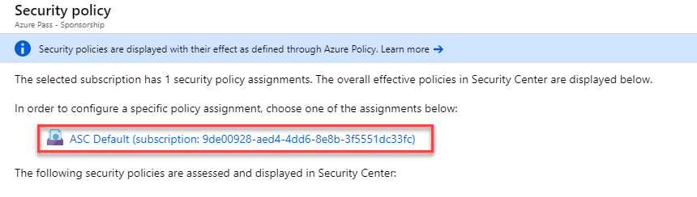

7.  In this example, the ASC agent has not been deployed to a VM or physical machine so the message AuditIfNotExists is displayed. AuditIfNotExists enables auditing on resources that match the if condition. If the resource is not deployed, NotExists is displayed.

       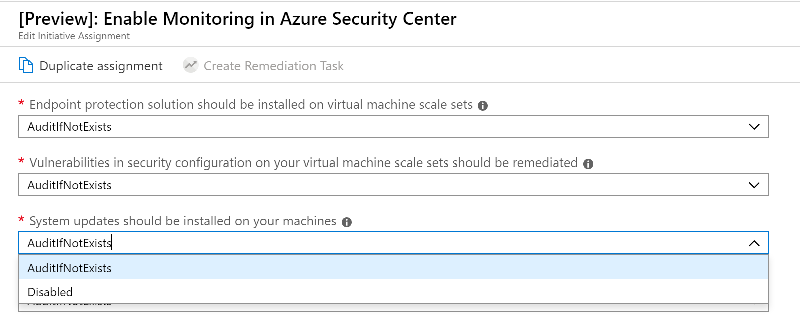

    If enabled, Audit is displayed. If deployed but disabled, Disabled is displayed.

       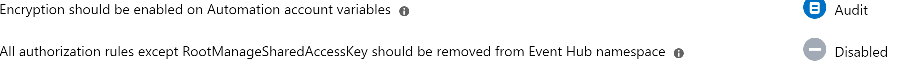

### Task 2: Enable Security Configurations

Azure Security Center monitors security configurations by applying a set of over 150 recommended rules for hardening the OS, including rules related to firewalls, auditing, password policies, and more. If a machine is found to have a vulnerable configuration, Security Center generates a security recommendation.

1.  Sign in to the Azure portal.

2.  On the Hub menu select **Security Center**.

3.  Select **Security Policy** then select your **Subscription**.

1.  Click **View effective policy**.

4.  The Policy Management screen is displayed.

5.  Check that **Vulnerabilities in security configuration on your virtual machine scale sets should be remediated** is one of the policies.

       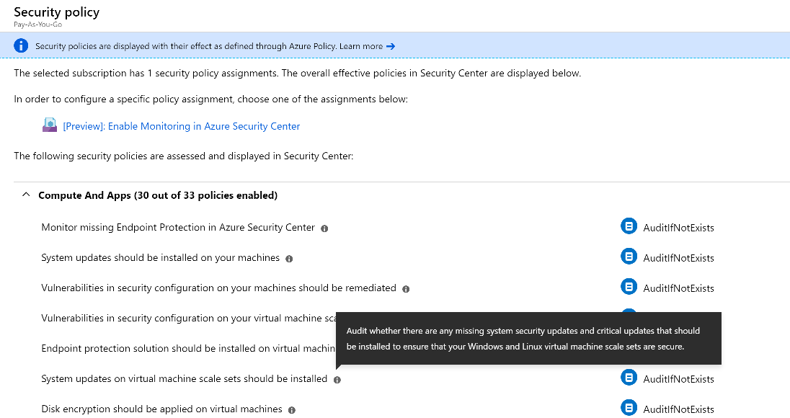

    **Note**: All of the following policies that have a (*) in their title are listed in the Security policies blade as described above

      - **Enable Endpoint Protection** - _Endpoint protection is recommended for all virtual machines._
      - **Enable Disk Encryption** - _Azure Security Center recommends that you apply disk encryption if you have Windows or Linux VM disks that are not encrypted using Azure Disk Encryption. Disk Encryption lets you encrypt your Windows and Linux IaaS VM disks. Encryption is recommended for both the OS and data volumes on your VM._
      - **Enable Network Security Groups** _Azure Security Center recommends that you enable a network security group (NSG) if one is not already enabled. NSGs contain a list of Access Control List (ACL) rules that allow or deny network traffic to your VM instances in a Virtual Network. NSGs can be associated with either subnets or individual VM instances within that subnet. When an NSG is associated with a subnet, the ACL rules apply to all the VM instances in that subnet. In addition, traffic to an individual VM can be restricted further by associating an NSG directly to that VM._
      - **Enable Web Application Firewall** - _Azure Security Center may recommend that you add a web application firewall (WAF) from a Microsoft partner to secure your web applications._
      - **Enable Vulnerability Assessment** - _The vulnerability assessment in Azure Security Center is part of the Security Center virtual machine (VM) recommendations. If Security Center doesn't find a vulnerability assessment solution installed on your VM, it recommends that you install one. A partner agent, after being deployed, starts reporting vulnerability data to the partner's management platform. In turn, the partner's management platform provides vulnerability and health monitoring data back to Security Center._
      - **Enable Storage Encryption** - _When this setting is enabled, any new data in Azure Blobs and Files will be encrypted._
      - **Enable JIT Network Access** - _Just-in-time (JIT) virtual machine (VM) access can be used to lock down inbound traffic to your Azure VMs, reducing exposure to attacks while providing easy access to connect to VMs when needed._
      - **Enable Adaptive Application Controls** - _Adaptive application control is an intelligent, automated end-to-end application whitelisting solution from Azure Security Center. It helps you control which applications can run on your Azure and non-Azure VMs (Windows and Linux), which, among other benefits, helps harden your VMs against malware. Security Center uses machine learning to analyze the applications running on your VMs and helps you apply the specific whitelisting rules using this intelligence. This capability greatly simplifies the process of configuring and maintaining application whitelisting policies._
      - **Enable SQL Auditing & Threat Detection** - Azure Security Center will recommend that you turn on auditing and threat detection for all databases on your Azure SQL servers if auditing is not already enabled. Auditing and threat detection can help you maintain regulatory compliance, understand database activity, and gain insight into discrepancies and anomalies that could indicate business concerns or suspected security violations.
      - **Enable SQL Encryption** - _Azure Security Center will recommend that you enable Transparent Data Encryption (TDE) on SQL databases if TDE is not already enabled. TDE protects your data and helps you meet compliance requirements by encrypting your database, associated backups, and transaction log files at rest, without requiring changes to your application._
      - **Set Security Contact Email and Phone Number** - _Azure Security Center will recommend that you provide security contact details for your Azure subscription if you haven't already. This information will be used by Microsoft to contact you if the Microsoft Security Response Center (MSRC) discovers that your customer data has been accessed by an unlawful or unauthorized party. MSRC performs select security monitoring of the Azure network and infrastructure and receives threat intelligence and abuse complaints from third parties._

6.  Select **Cost Management + Billing**.

    **Note**: The following steps will not work with an Azure Pass subscription but reamins in this lab in order to identify the steps requried in a Real World scenrio.

7.  The Contact info screen is displayed.

8.  Enter or validate the contact information displayed.

       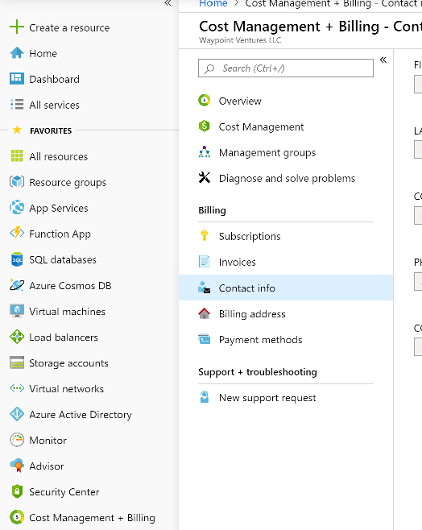

### Task 3: Enable Send me emails about alerts 

Azure Security Center will recommend that you provide security contact details for your Azure subscription if you haven't already.

1.  On the Hub menu select **Security Center**.
1.  Select **Pricing & settings**.
3.  The Pricing & settings screen is displayed.
4.  Click on your Subscription.
5.  Click **Email notifications**.
6.  Select **Save**. 

     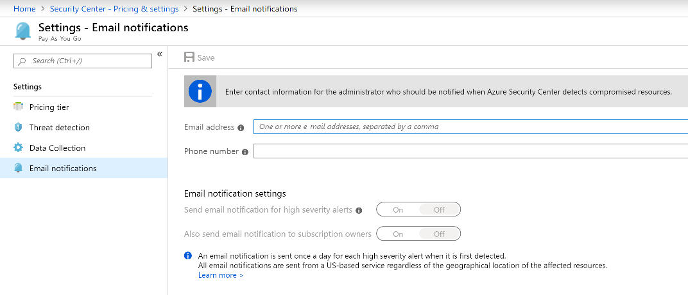

### Task 4: Enable Send email also to subscription owners 

Azure Security Center will recommend that you provide security contact details for your Azure subscription if you haven't already.

1.  Using the above Email notifications form, additional emails can be added separated by commas.

1.  Click **Save**.

## Exercise 3: Create an Azure storage accounts baseline 

An Azure storage account provides a unique namespace to store and access your Azure Storage data objects.  Storage Accounts also need to be secured.

### Task 1: Require security-enhanced transfers

Another step you should take to ensure the security of your Azure Storage data is to encrypt the data between the client and Azure Storage. The first recommendation is to always use the HTTPS protocol, which ensures secure communication over the public Internet. You can enforce the use of HTTPS when calling the REST APIs to access objects in storage accounts by enabling Secure transfer required for the storage account. Connections using HTTP will be refused once this is enabled.

1.  Go to **Storage Accounts** under **All services**.

3.  Select the storage account.

4.  Under **Settings**, select **Configuration**.

5.  Ensure **Secure Transfer required** is set to **Enabled**.

       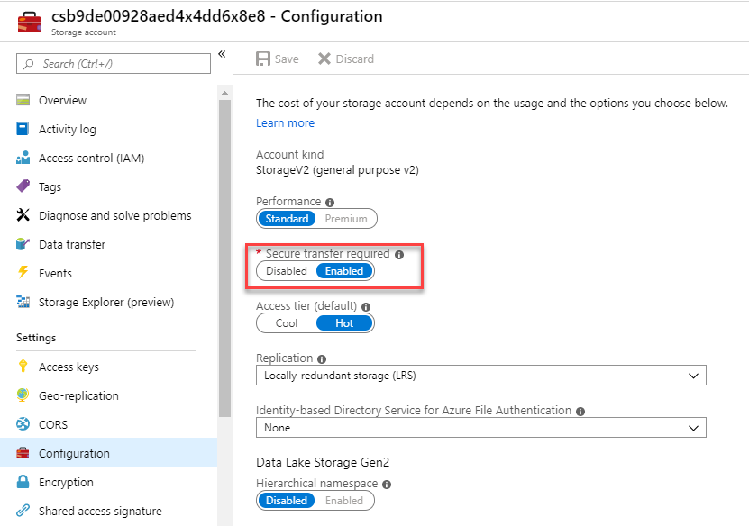

### Task 2: Enable binary large object (blob) encryption

Azure Blob storage is Microsoft's object storage solution for the cloud. Blob storage is optimized for storing massive amounts of unstructured data. Unstructured data is data that does not adhere to a particular data model or definition, such as text or binary data. Storage service encryption protects your data at rest. Azure Storage encrypts your data as it's written in its datacenters, and automatically decrypts it for you as you access it.

1.  Go to Storage Accounts under Azure services.
3.  Select the storage account.
4.  Under **Settings**, select **Encryption**.
5.  Azure Storage encryption is enabled by default and cannot be disabled. 

     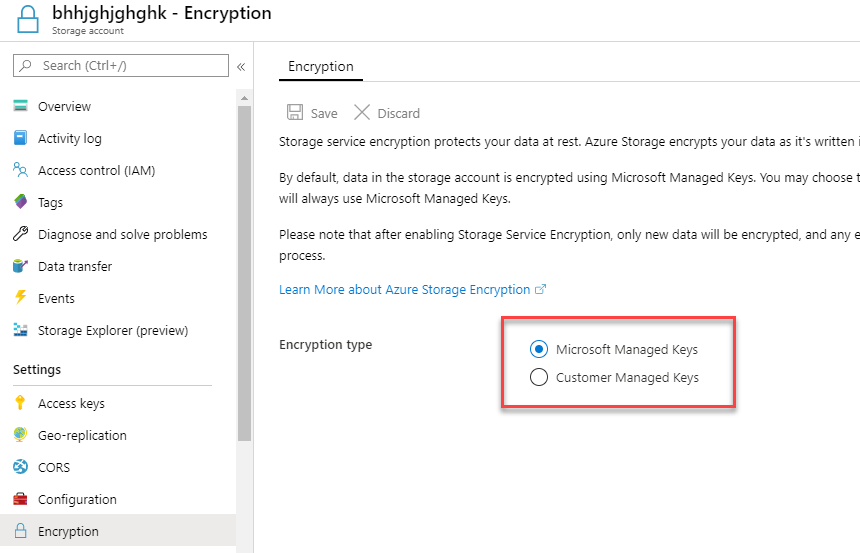

### Task 3: Periodically regenerate access keys

When you create a storage account, Azure generates two 512-bit storage access keys, which are used for authentication when the storage account is accessed. Rotating these keys periodically ensures that any inadvertent access or exposure to these keys could be undermined.

1.  Go to **Storage Accounts** under Azure services.

3.  Select the storage account.
4.  For the storage account, go to **Activity log**.
5.  Under Timespan drop-down, select **Custom** and choose Start Time and End Time so it creates a 90 day range.
6.  Click **Apply**. 
 
     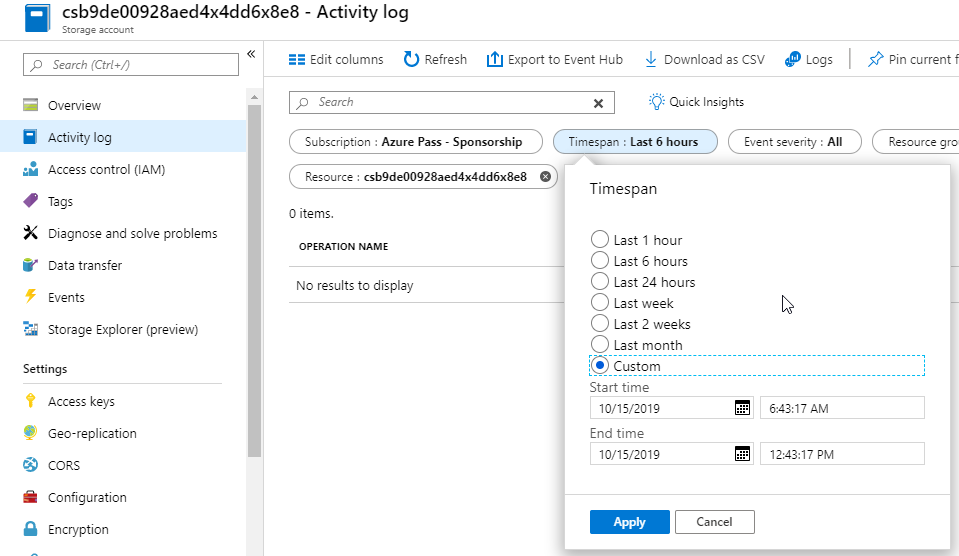

### Task 4: Require Shared Access Signature (SAS) tokens to expire within an hour

A shared access signature (SAS) is a URI that grants restricted access rights to Azure Storage resources. You can provide a shared access signature to clients who should not be trusted with your storage account key but to whom you wish to delegate access to certain storage account resources. By distributing a shared access signature URI to these clients, you can grant them access to a resource for a specified period of time, with a specified set of permissions.

Currently verification of a SAS token expiry times cannot be accomplished. Until Microsoft makes token expiry time as a setting rather than a token creation parameter, this recommendation would require a manual verification.

1.  Go to **Storage Accounts**.

3.  Select the existing account.
4.  For the storage account, go to **Shared Access signature**.
5.  Set the Start and expiry date/time.
6.  Set Allowed protocols to HTTPS only.

    Both SAS features are shown below. 
 
    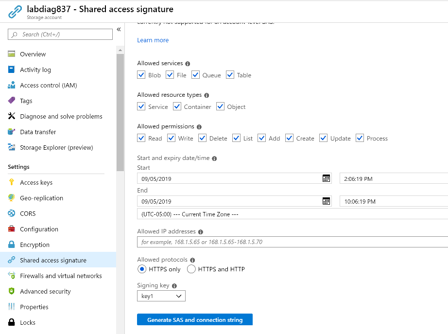
 

### Task 5: Require only private access to blob containers 

You can enable anonymous, public read access to a container and its blobs in Azure Blob storage. By doing so, you can grant read-only access to these resources without sharing your account key, and without requiring a shared access signature (SAS). By default, a container and any blobs within it may be accessed only by a user that has been given appropriate permissions. To grant anonymous users read access to a container and its blobs, you can set the container public access level. When you grant public access to a container, then anonymous users can read blobs within a publicly accessible container without authorizing the request.

1.  Go to **Storage Accounts**.
3.  For the storage account, select **Containers** under **Blob Service**.
1.  Click **+ Container**.
1.  Give the container the name **az500** and click **OK**.

4.  Ensure that Public access level to Private.

     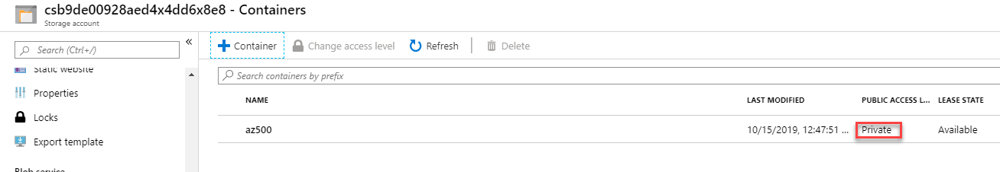

## Exercise 4: Create an Azure SQL Database baseline

Azure SQL Server is a cloud-based relational database server that supports many of the same features as Microsoft SQL Server. It provides an easy transition from an on-premises database into a cloud-based one with built-in diagnostics, redundancy, security and scalability.  This exercise looks at the security recommendations to set Azure SQL Server policies.

### Task 1: Enable auditing

Auditing for Azure SQL Database and SQL Data Warehouse tracks database events and writes them to an audit log in your Azure storage account, OMS workspace or Event Hubs. Auditing also:

-   Helps you maintain regulatory compliance, understand database activity, and gain insight into discrepancies and anomalies that could indicate business concerns or suspected security violations.
-   Enables and facilitates adherence to compliance standards, although it doesn't guarantee compliance.

1.  In the Azure Portal go to **SQL databases**.
1.  Click **+ Add**.
1.  Create the database with the following settings then click **Review + create** and click **Create**:

      - **Resource Group**: Select myResourceGroup
      - **Database name**: az500
      - **Server**: **Create new**
         - **Server Name** Give the server a unique name
         - **Server admin login**: localadmin
         - **Password**: Pa55w.rd1234
         - **Location**: EastUS

1.  Once the deployment is complete, click **Go to resource**.

4.  Select **Auditing**, under the **Security** section.

1.  Click **View server settings**.

     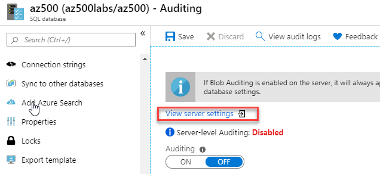
 
1.  Select **On** and check the box next to **Log Analytics**.

1.  Select your Log Analyics workspace created in earlier labs and then click **Save**.

     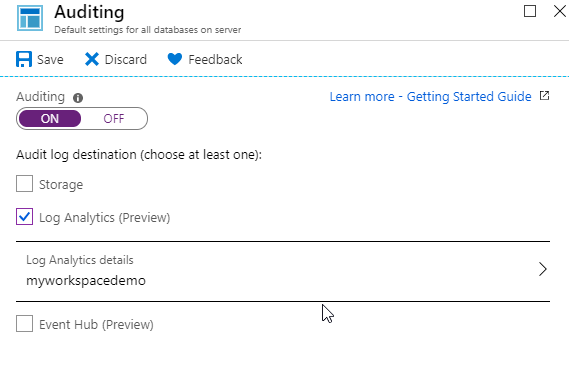

1.  Exit the Auditing blade.

5.  Ensure that Auditing is set to **On** and check the box next to **Log Analytics**.

1.  Select your Log Analyics workspace created in earlier labs and then click **Save**.

     

### Task 2: Enable a threat detection service

Threat detection for single and pooled databases detects anomalous activities indicating unusual and potentially harmful attempts to access or exploit databases. Threat detection can identify Potential SQL injection, Access from unusual location or data center, Access from unfamiliar principal or potentially harmful application, and Brute force SQL credentials. Threat detection is part of the advanced data security (ADS) offering, which is a unified package for advanced SQL security capabilities. Threat detection can be accessed and managed via the central SQL ADS portal.

1.  In the Azure portal go to **SQL databases**.

2.  Under **Security**, then navigate to **Advanced Data Security**.
3.  Click **Settings**.
4.  Select **Enable Advanced Data Security on the server** and click **Yes** then click **Save**.

### Task 3: Enable all threat detection types 

Advanced data security (ADS) provides a set of advanced SQL security capabilities, including data discovery & classification, vulnerability assessment, and Advanced Threat Protection (ATP).

Advanced Threat Protection is part of the advanced data security (ADS) offering, which is part of the defense in depth SQL security strategy. Advanced Threat Protection can be accessed and managed via the central SQL ADS portal.

1.  In the Azure portal go to **SQL databases**.
4.  Under **Security**, then navigate to **Advanced Data Security**.
1.  Click **Settings**.

7.  Ensure that **Send alerts** is set as appropriate.

     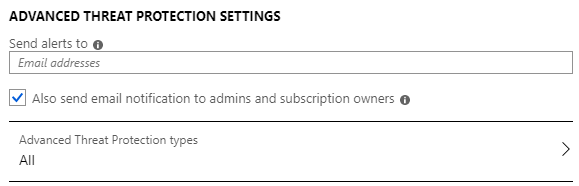

## Exercise 5: Create a logging and monitoring baseline

Logging and monitoring are a critical requirement when trying to identify, detect, and mitigate security threats. Having a proper logging policy can ensure you can determine when a security violation has occurred, but also potentially identify the culprit responsible. Azure Activity logs provide data about both external access to a resources and diagnostic logs, which provide information about the operation of that specific resource.

### Task 1: Ensure that a log profile exists

The Azure Activity Log provides insight into subscription-level events that have occurred in Azure. This includes a range of data, from Azure Resource Manager operational data to updates on Service Health events. The Activity Log was previously known as Audit Logs or Operational Logs, since the Administrative category reports control-plane events for your subscriptions. There is a single Activity Log for each Azure subscription. It provides data about the operations on a resource from the outside. Diagnostic Logs are emitted by a resource and provide information about the operation of that resource. You must enable diagnostic settings for each resource.

1.  In the Azure Portal go to **Monitor**, then select **Activity log**.

1.  Click **Diagnostic settings**.

    

1.  Click the purple banner for the legacy experience.

    

3.  Configure the following settings then click **Save**.

      - **Region**: EastUS
      - **Select**: Export to Storage Account
      - **Storage Account**: Select your storage account and click OK
      - **Retention**: 90 days

4.  Select **Save**.

     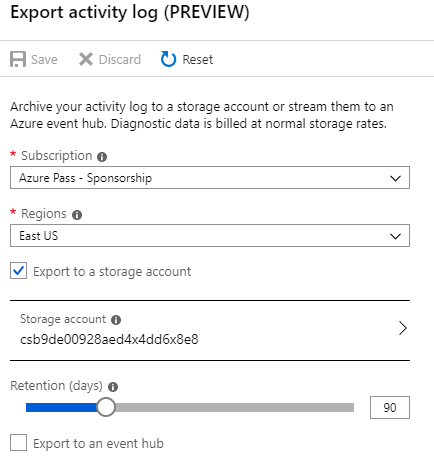

### Task 2: Change activity log retention is set to 365 days or more

Setting the Retention (days) to 0 retains the data forever.

1.  Follow the steps listed above. Adjust the Retention days slider bar.

### Task 3: Create an activity log alert for "Creating, updating, or deleting a Network Security Group" 

By default, no monitoring alerts are created when NSGs are created/updated/deleted. Changing or deleting a security group can allow internal resources to be accessed from improper sources, or for unexpected outbound network traffic.

1.  In to the Azure portal go to **Monitor**, then select **Alerts**.

3.  Select **+ New alert rule**.

4.  In the **Resource** section click **Select**.

1.  Select your subscription and click **Done**.

4.  In the **Condition** section click **Add**.

1.  Search for **Create or Update Network Security Group** and select it.

1.  On the Configure signal logic blade, in the Event initiated by enter **any** and click **Done**.

     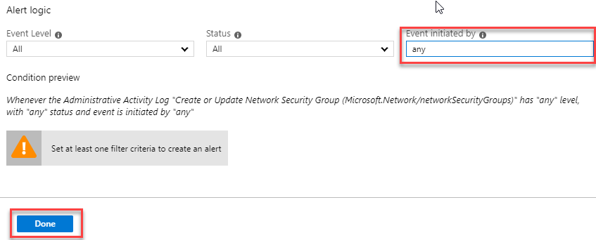

1.  In the **Actions** section click **Create action group**.

1.  On the Add action group blade enter the following details:

      - **Action group name**: NSG Alert
      - **Short name**: NSGAlert
      - **Action  Name**: NSG Alert
      - **Action type**: Email/SMS/Push/Voice

1.  On the **Email/SMS/Push/Voice** blade check the email box and enter your email address and click **OK**.

     

1.  On the Add action group blade click **OK**.

     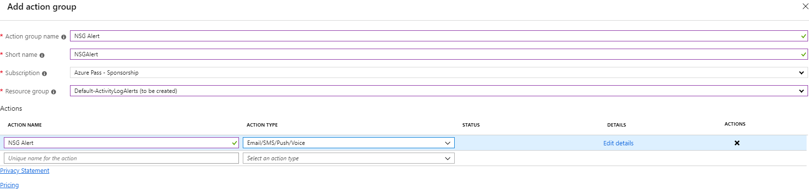

1.  On the Create rule blade, in the **Alert Details** section enter the following details:

      - **Alert rule name**: NSG Alert
      - **Save to resource group**: myResourceGroup

     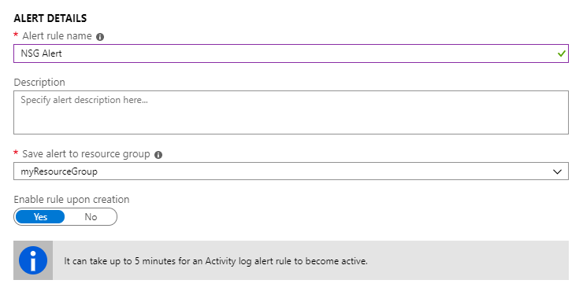

6.  Click **Create alert rule**

## Exercise 6: Create a Networking baseline

Azure networking services maximize flexibility, availability, resiliency, security, and integrity by design. Network connectivity is possible between resources located in Azure, between on-premises and Azure-hosted resources, and to and from the Internet and Azure.

### Task 1: Restrict RDP and SSH access from the Internet 

It's possible to reach Azure virtual machines by using Remote Desktop Protocol (RDP) and the Secure Shell (SSH) protocol. These protocols enable the management VMs from remote locations and are standard in datacenter computing.

The potential security problem with using these protocols over the Internet is that attackers can use brute force techniques to gain access to Azure virtual machines. After the attackers gain access, they can use your VM as a launch point for compromising other machines on your virtual network or even attack networked devices outside Azure.

It's recommended that you disable direct RDP and SSH access to your Azure VMs from the Internet. After direct RDP and SSH access from the Internet is disabled, you have other options that you can use to access these VMs for remote management:

- Point-to-site VPN
- Site-to-site VPN
- Azure ExpressRoute
- Azure Bastion Host

1.  In the Azure portal click **Virtual machines**.

1.  Select **myVM**.

1.  open the **Networking** blade.

1.  Select the rule which allows RDP (Port 3389) then click **Delete**.

     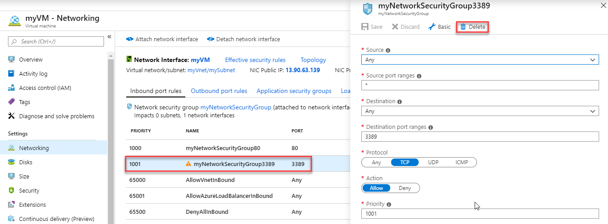

### Task 2: Restrict SQL Server access from the Internet 

Firewall systems help prevent unauthorized access to computer resources. If a firewall is turned on but not correctly configured, attempts to connect to SQL Server might be blocked.

To access an instance of the SQL Server through a firewall, you must configure the firewall on the computer that is running SQL Server. Allowing ingress for the IP range `0.0.0.0/0` (Start IP of `0.0.0.0` and End IP of `0.0.0.0`) allows open access to any/all traffic potentially making the SQL Database vulnerable to attacks. Ensure that no SQL Databases allow ingress from the Internet.

1.  In the Azure portal go to **SQL servers** and select your SQL Server.

4.  Click on **Firewalls and virtual networks**.

     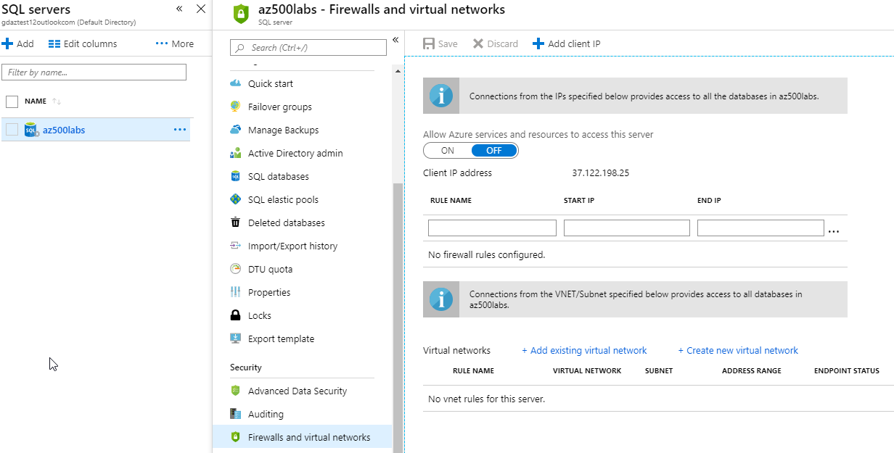

5.  Ensure that the firewall rules exist, and no rule has a Start IP of `0.0.0.0` and End IP of `0.0.0.0` or other combinations which allows access to wider public IP ranges.

6.  Close the blade.

### Task 3: Configure the NSG flow logs

When you create or update a virtual network in your subscription, Network Watcher will be enabled automatically in your Virtual Network's region. There is no impact to your resources or associated charge for automatically enabling Network Watcher.

Network security group (NSG) flow logs are a feature of Network Watcher that allows you to view information about ingress and egress IP traffic through an NSG. Flow logs are written in JSON format, and show outbound and inbound flows on a per rule basis, the network interface (NIC) the flow applies to, 5-tuple information about the flow (Source/destination IP, source/destination port, and protocol), if the traffic was allowed or denied, and in Version 2, throughput information (Bytes and Packets). Logs can be used to check for anomalies and give insight into suspected breaches.

1.  In the Azure portal select **All services**.

3.  Select **Networking**.

4.  Select **Network Watcher**.

5.  Select **NSG flow logs** under Logs.

1.  Select **On**.

1.  Select a storage account and click **Save**.

 

### Task 4: Enable Network Watcher 

Network security group (NSG) flow logs are a feature of Network Watcher that allows you to view information about ingress and egress IP traffic through an NSG.

1.  In the Azure portal select All services. In the Filter box, enter **Network Watcher**. When Network Watcher appears in the results, select it.

3.  Select Regions, to expand it, and then select the elipsis (...) button on a region which is not enabled.

4.  Select **Enable Network Watcher**.

     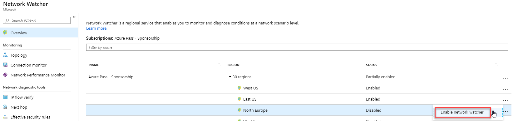

## Exercise 7: Create an Azure VM baseline

Azure Policy is a service in Azure that you use to create, assign, and manage policies. These policies enforce different rules and effects over your resources, so those resources stay compliant with your corporate standards and service level agreements. Azure Policy meets this need by evaluating your resources for non-compliance with assigned policies. For example, you can have a policy to allow only a certain SKU size of virtual machines in your environment. Once this policy is implemented, new and existing resources are evaluated for compliance. With the right type of policy, existing resources can be brought into compliance.

**Azure networking security recommendations**

Here are the security recommendations you should follow to set Virtual Machine (VM) policies on your Azure subscription. Included with each recommendation are the basic steps to follow in the Azure portal. You should perform these steps on your own subscription with your own resources to validate the security for each. Keep in mind that Level 2 options might restrict some features or activity, so carefully consider which security options you decide to enforce.

### Task 1: Ensure that OS disk are encrypted

Azure Disk Encryption helps protect and safeguard your data to meet your organizational security and compliance commitments. It uses the BitLocker feature of Windows and the DM-Crypt feature of Linux to provide volume encryption for the OS and data disks of Azure virtual machines (VMs). It is also integrated with Azure Key Vault to help you control and manage the disk encryption keys and secrets, and ensures that all data on the VM disks are encrypted at rest while in Azure storage. Azure Disk Encryption for Windows and Linux VMs is in General Availability in all Azure public regions and Azure Government regions for Standard VMs and VMs with Azure Premium Storage.

If you use Azure Security Center (recommended), you're alerted if you have VMs that aren't encrypted.

1.  In the Azure portal search for **KeyVault**.

1.  Select **Key Vault** and click **Create**.

1.  Enter the following details:

      - **Resource Group**: myResourceGroup
      - **Key vault name**: _Enter something unique_
      - **Region**: EastUS
   
     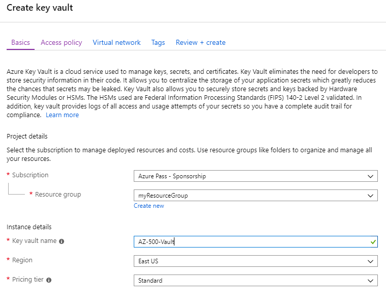

1.  Select the **Access policy** tab and select **Azure Disk Encryption** for volume encryption.

     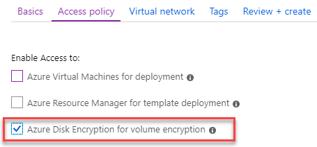

1.  Click **Review + create** then click **Create**.

1.  Wait for the deployment to complete before continuing.

1.  In the Azure portal select **Virtual machines**.

1.  Select **myVM** virtual machine.

3.  Under the **Settings** section select **Disks**.

1.  Notice the disk is not encrypted.

     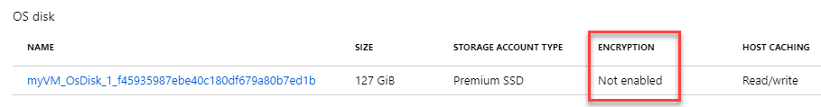

1.  Click **Encryption**.

     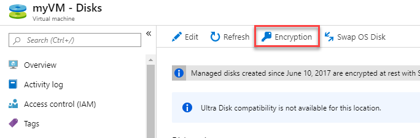

5.  Select **OS & data disks** to be encrypted.

1.  Click **Select a key vault and key for encryption** and select your vault and click **Select**.

1.  Click **Save** and click **Yes** to confirm.

### Task 2: Ensure only approved extensions are installed

Azure virtual machine (VM) extensions are small applications that provide post-deployment configuration and automation tasks on Azure VMs. For example, if a virtual machine requires software installation, anti-virus protection, or to run a script inside of it, a VM extension can be used. Azure VM extensions can be run with the Azure CLI, PowerShell, Azure Resource Manager templates, and the Azure portal. Extensions can be bundled with a new VM deployment, or run against any existing system.

1.  In the Azure portal select **Virtual machines**.

3.  Select **myVM** and then in the **Settings** section click **Extensions**.
5.  Ensure that the listed extensions are approved for use.

     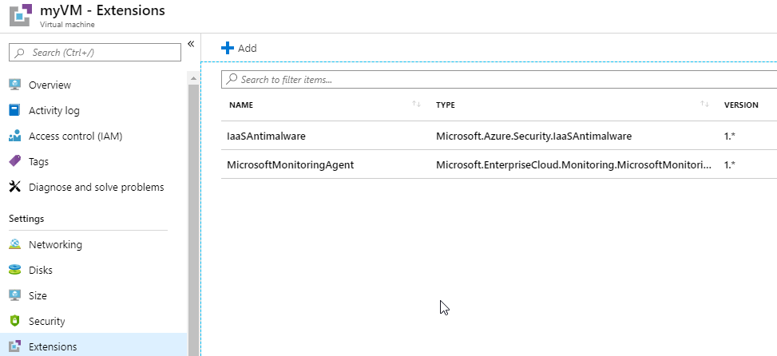

**Results**: You have now completed this lab.

